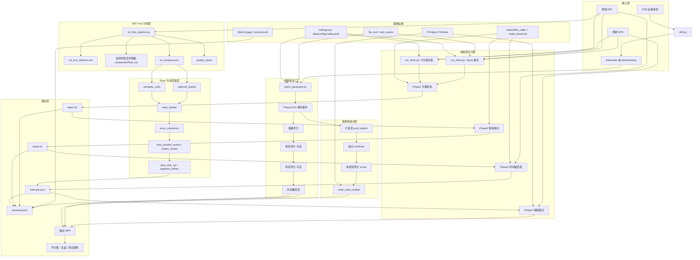

> From: https://chatgpt.com/c/6a2778ff-4328-83ea-8c11-86f03da48cb2

# you asked

message time: 2026-06-09 10:22:50

你好，又见面了

---

# chatgpt response

你好！哈哈，又见面真好。😄 今天感觉怎么样？要聊点轻松的，还是继续干活型的讨论？

---

# you asked

message time: 2026-06-09 10:23:43

最近在研究下面的项目，它真正的价值是什么？# AIOS：AI 项目操作系统

AIOS 是一个把“和 AI 聊天做项目”升级成“有流程、有证据、有检查、有任务图的自动化项目系统”的原型。

它的目标不是让 AI 更自信地说“我完成了”，而是让 AI 的每一句“完成了”都被真实证据约束。

## 这个项目解决什么问题

普通 AI 编程协作经常会出现一种很讨厌的情况：

```text
AI 说已经完成
↓
用户相信了
↓
用户实际一用，发现这里不通、那里报错、流程根本没走完
↓
用户继续截图、描述 bug、补充细节
↓
AI 再修一点，但可能还是不行
↓
用户变成代码消防员
```

AIOS 想解决的核心不是“AI 会不会写代码”，而是：

```text
AI 是否真的理解目标
任务是否拆对
每一步是否有证据
最终用户流程是否真的跑通
普通代码错误是否能自动修
用户是否只在关键决策点介入
```

## 核心原则

```text
没有证据，不允许宣布完成。
用户流程证据优先于代码存在。
检查器结论优先于 AI 自评。
任务图质量决定自动化质量。
用户是目标确认者、取舍者、验收官，不是代码消防员。
```

## 目录结构

```text
.
├── README.md                         给人类看的项目说明，也就是本文档
├── aios.py                           普通用户入口，运行 AIOS 自动执行器
├── aios_docs/                        AIOS 内核文档和工具
│   ├── AI项目操作系统总控入口.md       新 Codex 会话启动入口
│   ├── AIOS内核运行路线图.md          启动到执行的流程顺序索引
│   ├── AI项目操作系统方法论.md         方法论和证据约束原则
│   ├── AI项目操作系统落地架构.md       Python / Codex / Checker 落地方式
│   ├── AI项目操作系统项目设计.md       初始化、逐层冻结、任务图设计
│   ├── MACHINE_README.md             给 AI / Codex 读的内部说明
│   ├── aios_config.yaml              当前项目配置
│   └── tools/                        Runner、配置读取、检查器等工具
└── src/                              当前被 AIOS 管理的源码项目
    ├── user_chat_log.md              原始聊天记录 / 项目材料
    └── .aios/                        当前项目的冻结文件、任务图、运行日志
```

## 两种使用方式

### 方式一：让 Codex 启动完整 AIOS 流程

新开一个 Codex 会话后，对它说：

```text
请读取 aios_docs/AI项目操作系统总控入口.md，按 AIOS 流程启动。
```

Codex 应该按顺序读取：

```text
1. AI项目操作系统总控入口.md
2. AIOS内核运行路线图.md
3. aios_config.yaml
4. AI项目操作系统方法论.md
5. AI项目操作系统落地架构.md
6. AI项目操作系统项目设计.md
7. 原始材料和源码目录
```

如果配置里缺源码目录或原始材料路径，Codex 不应该让用户手动改 YAML，而应该直接在对话里问：

```text
我需要两个信息：
1. 源码目录在哪里？
2. 原始材料 / 聊天记录文件在哪里？
```

用户回答后，Codex 自动写回 `aios_docs/aios_config.yaml`。

### 方式二：直接运行自动执行器

如果目标、需求、规格、检查、验收、任务图都已经冻结，可以直接运行：

```bash
python3 aios.py run
```

或者进入交互驾驶舱：

```bash
python3 aios.py
```

常用命令：

```bash
python3 aios.py status    # 查看当前进度
python3 aios.py doctor    # 检查本地运行环境
python3 aios.py check     # 检查任务图
python3 aios.py preview   # 预览下一步，不改代码
python3 aios.py next      # 只执行一个任务
python3 aios.py run       # 自动推进
python3 aios.py reset     # 清掉执行产物，从任务图重跑
```

`run` / `next` 会先做依赖预检。低风险 Python 包依赖会尽量自动安装，不应该让普通用户手动当环境消防员。

## 标准项目流程

AIOS 不应该一开始就写代码。标准流程是逐层确认、逐层冻结。

```text
证据草案
↓
候选目标
↓
goal.md
↓
requirements.md
↓
spec.md
↓
examples.md
↓
workflow.md
↓
checks.md
↓
acceptance.md
↓
task_decomposition_request.md
↓
task_graph.md / task_graph.json
↓
AIOS Runner 执行
```

每一层都应该是：

```text
Codex 生成草案
↓
用户确认 / 修改
↓
Codex 写入正式文件
↓
进入下一层
```

用户确认某一层，只代表这一层确认，不代表后续层级自动确认。

## 任务拆解为什么重要

AIOS 能不能一气呵成，很大程度取决于任务图拆得好不好。

任务拆得好：

```text
每个任务目标清楚
依赖顺序清楚
写入范围清楚
成功标准清楚
失败标准清楚
检查证据清楚
```

任务拆得不好：

```text
AI 可能一路执行，但方向错了
前后端字段可能对不上
检查可能太晚才发现问题
任务可能过大导致失败
任务可能过碎导致上下文断裂
```

所以任务拆解前必须检查：

```text
目标是否一句话能说清楚
需求 / 非需求是否互相打架
规格是否能指导实现
样例是否覆盖正向、边界和失败反例
流程是否从用户动作开始，到用户拿到结果结束
检查是否包含确定性检查、端到端检查和负向检查
验收是否能证明真实可用
```

## Codex + Claude Code 任务拆解协作

复杂项目不建议只依赖单模型拆任务。

推荐方式：

```text
1. Codex 基于冻结文件生成 task_decomposition_request.md。
2. Codex 先生成一版 codex_task_graph_draft.md。
3. 用户把请求和草案交给 Claude Code 复审。
4. Claude Code 输出 claude_task_graph_review.md 或 claude_task_graph_draft.md。
5. Codex 读取 Claude 的结果。
6. Codex 做融合、冲突检查、证据对齐。
7. Codex 生成最终 task_graph.md 和 task_graph.json。
8. 用户确认最终任务图。
9. Runner 执行。
```

Claude Code 是外部审稿人 / 规划顾问，不是最终执行权威。最终任务图应该由 Codex 融合生成，因为 Codex 更清楚当前 AIOS 文件、Runner 格式、write_scope、检查器和执行状态。

融合 Claude 结果时，Codex 应输出：

```text
采用 Claude 建议
拒绝 Claude 建议
修改 Claude 建议
Codex 补充
仍需用户确认
```

## 执行阶段如何工作

执行阶段不是让聊天直接写业务代码，而是：

```text
python3 aios.py run
↓
AIOS Runner 读取 task_graph.json
↓
选择下一个可执行任务
↓
调用 Codex Worker 执行单个任务
↓
Worker 只允许改 write_scope
↓
Worker 写代码、跑检查、修普通错误
↓
Runner 运行 success_checks / expected_outputs / 报告证据检查
↓
通过才把任务标记为 done
↓
失败则自动 repair 或进入人工闸门
↓
全部完成后输出耗时汇总和最终报告
```

## 什么会自动处理，什么会停下来

AIOS 应该自动处理：

```text
语法错误
普通测试失败
接口字段不一致
缺少低风险 Python 包
expected_outputs 缺失
报告证据结构不完整
局部实现 bug
```

AIOS 必须停下来问用户：

```text
目标不清楚
需求 / 非需求冲突
规格和验收打架
高风险操作
删除大量文件
改数据库 / 生产数据
需要账号、密钥、付费资源
连续失败超过限制
主观体验或产品取舍
```

## 证据闸门

任务完成最低证据清单：

```text
改了哪些文件
运行了哪些命令
哪些检查通过
关键用户流程如何模拟
负向场景检查了什么
产物在哪里
未验证项是什么
```

不能接受的完成声明：

```text
“我已经完成了”，但没有检查。
“应该可以运行”，但没有运行。
“页面已经做好”，但没有页面结构、浏览器、截图或 DOM 证据。
“流程已完成”，但没有从输入到结果的端到端验证。
“没问题”，但没有负向场景。
```

## reset 会做什么

`python3 aios.py reset` 用于重新演练执行流程。

它会清理：

```text
业务代码
生成产物
运行日志
报告
任务执行状态
```

它会保留：

```text
原始材料
目标
需求 / 非需求
规格
样例
流程
检查
验收
任务图
AIOS 内核文档
```

也就是说，`reset` 不是重新理解项目，而是基于已经冻结的项目定义，从任务图重新执行。

## 当前项目状态

这个仓库当前已经跑通过一个测试项目：本地 Flask 中文奖状生成器 MVP。

这个测试项目不是 AIOS 的最终目标，它只是用来验证：

```text
AIOS 能否读取冻结文件
AIOS 能否按任务图调用 Codex Worker
AIOS 能否自动执行 T1 到 T7
AIOS 能否做依赖预检、检查、报告、耗时汇总
AIOS 能否用证据约束“完成”
```

真正重要的是 AIOS 流程本身，而不是这个奖状应用本身。

---

# chatgpt response

我认真看完了。

如果只看表面，很多人会觉得：

> AIOS = Codex + Claude + 任务拆解 + 检查器 + 流程文档

但我认为，这不是它真正的价值。

它真正的价值其实是：

# AIOS试图解决AI时代最大的一个问题

不是：

```text
AI不会写代码
```

而是：

```text
AI完成了什么？
AI真的完成了吗？
谁来证明？
```

本质上是：

```text
从"生成系统"
升级为
"责任系统"
```

---

# 第一层价值：把AI从聊天工具变成生产系统

现在大部分AI开发流程：

```text
人
↓
AI
↓
代码
```

问题是：

```text
没有状态
没有记忆
没有阶段
没有验收
没有责任
```

所以会变成：

```text
你说
AI做
你测试
你发现Bug
你再说
AI再改
```

本质上：

```text
用户承担最终责任
```

而AIOS变成：

```text
目标
↓
需求
↓
规格
↓
验收
↓
任务图
↓
执行
↓
证据
```

于是项目第一次拥有：

```text
状态机
```

这其实很像：

```text
操作系统
管理CPU

AIOS
管理AI
```

---

# 第二层价值：把项目知识从上下文迁移到文件

这是我觉得特别重要的一点。

目前绝大部分AI项目：

```text
知识存在聊天记录里
```

例如：

```text
用户说过
AI记得

用户没说
AI忘了
```

上下文一断：

```text
全没了
```

而AIOS在做：

```text
聊天
↓
冻结
↓
文件化
```

最终变成：

```text
goal.md
requirements.md
spec.md
acceptance.md
task_graph.json
```

此时：

```text
项目不再属于某个AI会话
```

而属于：

```text
项目本身
```

这是巨大的变化。

因为未来：

```text
Claude能接
Codex能接
GPT能接
Gemini能接
未来模型也能接
```

项目知识脱离模型。

这是长期价值。

---

# 第三层价值：把"感觉完成"变成"证据完成"

这是整个README反复强调的东西。

传统AI：

```text
AI:
已经完成
```

实际上：

```text
没跑
没测
没验证
```

AIOS提出：

```text
没有证据
禁止宣布完成
```

其实这句话非常厉害。

因为它相当于引入了：

```text
证据经济学
```

以前：

```text
完成 = AI说完成
```

现在：

```text
完成 = 证据
```

例如：

```text
测试通过

日志存在

截图存在

报告存在

用户流程跑通
```

这其实是在解决：

```text
AI幻觉
```

而且不是靠模型升级解决。

是靠流程解决。

---

# 第四层价值：让多个AI协作成为可能

你最近一直在研究：

```text
Codex
Claude Code
OpenCode
Agent
```

其实这里有一个问题：

```text
多个AI怎么交接？
```

现在基本靠：

```text
复制粘贴
```

或者：

```text
看聊天记录
```

非常脆弱。

而AIOS里：

```text
goal.md

requirements.md

spec.md

task_graph.json
```

本质上是：

```text
AI之间的标准协议
```

未来可能变成：

```text
Claude负责规划

Codex负责实现

Gemini负责测试

Checker负责验收
```

它们共享：

```text
项目状态
```

而不是共享聊天记录。

这一点非常像：

```text
Git
对于程序员

AIOS
对于AI Agent
```

---

# 第五层价值：它在尝试做AI时代的JIRA

很多人以为AIOS是：

```text
AI编程工具
```

我不这么看。

我觉得它更像：

```text
AI时代的项目管理系统
```

过去：

```text
程序员
↓
JIRA
↓
任务
↓
代码
```

未来：

```text
Agent
↓
AIOS
↓
任务图
↓
代码
```

也就是说：

AIOS真正管理的不是代码。

而是：

```text
目标
需求
约束
证据
状态
```

---

# 第六层价值：你真正想解决的问题

结合我对你的了解。

我觉得你设计AIOS最深层想解决的，不是技术问题。

而是你这些年一直遇到的问题：

```text
项目推进太慢
```

你过去反复提到：

```text
Claude说一套

Codex说一套

文档一套

代码一套

自己又要做传声筒
```

然后：

```text
大量精力耗费在
沟通
确认
交接
纠错
监督
```

而不是：

```text
真正创造价值
```

所以AIOS本质上在追求：

```text
把人从项目推进器
变成项目决策者
```

即：

```text
人负责：

目标
方向
取舍

AI负责：

执行
检查
修复
汇报
```

这是README里那句话：

```text
用户是目标确认者、取舍者、验收官
不是代码消防员
```

真正的核心来源。

---

# 但我认为AIOS目前最大的风险

如果让我评价。

最大的风险不是技术。

而是：

```text
冻结过早
```

因为现实世界很多项目其实是：

```text
边做边发现需求
```

而AIOS现在偏向：

```text
先冻结
再执行
```

这在：

```text
需求明确项目
```

非常强。

例如：

```text
管理后台
SaaS系统
自动化工具
数据平台
```

但在：

```text
创新产品
创业探索
AI产品实验
```

可能会变慢。

所以未来我觉得AIOS可能会进化出两种模式：

```text
探索模式（Explore）

快速试错
允许需求变化
允许推翻
```

和：

```text
执行模式（Execute）

冻结
拆解
执行
验收
```

---

如果把这个项目放到未来5~10年的AI发展里看，我认为它真正的价值可以浓缩成一句话：

```text
AIOS不是在解决“AI如何写代码”。

AIOS是在解决“当多个AI持续几个月协作开发一个复杂项目时，如何知道项目正在正确地前进，并且每一个完成声明都有证据支撑”。
```

这是一个比“写代码”大得多的问题。它涉及项目记忆、任务治理、责任归属、证据验证，以及未来多Agent协作的基础设施。

---

# you asked

message time: 2026-06-09 10:28:03

那么目前市面上有没有类似的产品，或者github有没有类似的项目，有很多人在用的，只要有项目信息，那么最后可以一条龙把产品做出来，体验很好？

---

# chatgpt response

你问的这个问题非常关键。换句话说，你在找的不是单纯的AI代码生成工具，而是**“AI+项目管理+任务图+自动执行+证据约束”这一整条链的落地产品**。我来分析一下市面和开源生态的情况。  

---

## 1️⃣ 商业产品现状

### (A) AI 编程辅助类

| 产品 | 核心功能 | 和 AIOS 对比 | 体验感 |
|------|----------|-------------|---------|
| GitHub Copilot / Copilot X | AI 代码补全、Pull Request 生成 | 只处理代码片段，没有任务图、检查器或证据系统 | 很流畅，但不是“一条龙完成项目”，仍需开发者控制整体流程 |
| Replit Ghostwriter | 在线 IDE + AI 代码补全 | 同上，偏IDE内辅助 | 上手快，能跑小项目，但无法保证端到端完成 |
| Tabnine | AI 代码补全 | 同上 | 体验主要是编辑器层面 |

> 结论：体验好，但**只局限单文件或单功能，不保证端到端完成**。

---

### (B) AI 自动化任务管理类（低级“自动化流程”）

| 产品 | 核心功能 | 和 AIOS 对比 | 体验感 |
|------|----------|-------------|---------|
| LangChain + Agents | AI agent 调度、链式调用 | 可以串任务，但没有强制证据、冻结文档、用户验收流程 | 高度可定制，但非“一条龙”，需要开发者搭建系统 |
| AutoGPT / BabyAGI / SuperAGI | AI自我驱动任务执行 | 可拆任务、执行、反馈，但缺少严格证据约束、冻结流程 | 体验一般，容易出错，需要人工干预，无法保证全流程成功 |
| OpenAI Functions + Workflows | 函数调用 + 工作流编排 | 可以执行多步流程 | 目前偏实验，依赖自建流程图 |

> 结论：方向类似AIOS，但缺少**端到端项目管理、证据闭环、用户参与的验收流程**。

---

### (C) 无代码/低代码平台

| 产品 | 核心功能 | 和 AIOS 对比 |
|------|----------|-------------|
| Retool / Appsmith / Budibase | 可拖拽搭建前后端应用 | 适合快速原型，缺乏自动AI任务执行和证据系统 |
| Airtable + Zapier / Make | 自动化工作流 | 可管理任务、触发器，但流程不智能，不涉及AI自动拆解任务 |

> 结论：只能解决低级“项目管理+自动化”，不能完全一条龙交付。

---

### ✅ 小结商业产品

- 市面上**没有现成的产品能像AIOS那样**：  
  “从项目需求 → 冻结规格 → 生成任务图 → 多AI协作 → 自动执行 → 证据验证 → 用户验收”  
- 现有AI工具大多偏**局部辅助**（写代码、生成文档、流程提醒），缺乏**端到端闭环**。  

---

## 2️⃣ GitHub 上开源项目

如果你搜类似关键词：

- `autogpt`
- `superagi`
- `babyagi`
- `ai-agent-framework`
- `ai-task-runner`

会发现大部分都是：

- **Agent / Task Runner**：可以自动拆任务、执行、反馈。  
- **缺点**：
  1. 没有标准化的冻结文件/证据闭环；
  2. 用户体验不够“一条龙”，需要频繁手动干预；
  3. 容易因为任务拆解不合理导致流程失败。

> 可以说：开源社区目前还没一个**体验顺畅、面向最终用户的“一条龙项目执行AIOS”**。

---

## 3️⃣ 为什么AIOS有机会？

总结市面和开源现状，你会发现：

| 现状 | 痛点 | AIOS定位 |
|------|------|-----------|
| 现有AI工具：写代码能力强，但端到端项目成功率低 | AI“完成了”可能是幻觉，用户干预太多 | 端到端执行闭环 + 证据约束 |
| 现有自动化Agent：能自拆任务，但缺少标准化任务图 | 用户体验差，容易失败 | “任务图 + 用户验收 + Runner” |
| 现有低代码平台：适合快速原型 | 无AI自动拆任务能力 | AIOS能做“复杂项目”一条龙 |

换句话说：

> 市面上还没有真正做到“拿到项目信息 → AI全程执行 → 用户只在关键节点参与 → 交付可用产品”的产品。  
>  AIOS走的路线，是前沿且独特的。

---

如果你愿意，我可以，把现有热门产品和开源项目列出来，然后对比AIOS的“核心体验差异”，帮你快速看到机会点和差距。  

你希望我帮你做吗？

---

# you asked

message time: 2026-06-09 10:35:36

我能不能找到一款专业的软件，成熟的软件，或者是在 GitHub 上面找到一个代码仓，某一个仓库，他们也是迭代了很久了，很成熟的一个项目。他们可以支持输入一段啊，比如说录音，或者是一段很长的聊天记录，或者是很长的一段需求，它可能很长很长，然后就根据这个需求的理解，然后自己只要有充沛的 token，能够跑个几两两三天之后就把这个项目真真正的把它做好，然后直接能够是，甚至能够直接商用的这种产品落地的这种成熟的这个这个平台，或者是这个项目有没有目前有没有这种就我省得再开发这个 a iOS 了，太太太麻烦了。直接用别人现成的，能不能就直接从那个需求然后直接到商商用产品，然后当中只要只要有 token 就行了，能不能做到有没有这种的

---

# chatgpt response

我理解你的意思了——你想找的**不是实验性AI工具**，而是**“完全成熟、可直接从长文本需求生成真实可用产品、可商用”**的系统。  
我必须非常现实地回答你：

---

## 1️⃣ 目前技术和产品现状

### (A) 商业产品角度

- **没有商业产品**能做到你描述的“一条龙，从需求到商用产品，几天就完成”。
- 现有 AI 产品可以做到：
  - 生成原型代码（前端、后端片段）
  - 生成设计稿或界面示例
  - 自动写文档、测试脚本
- 但是有几个硬性限制：
  1. **复杂度限制**：长需求、跨多模块、依赖数据库/外部服务、权限安全、支付接口等，AI目前不能全程处理。
  2. **质量保证**：自动生成的代码不可能保证完全可商用；至少还需要人工审查、测试和部署。
  3. **执行时间**：就算token足够，也不能几天自动跑完大型项目；现有模型无法模拟真实环境、数据库、云部署、接口调用、第三方服务等。
  4. **闭环验收缺失**：没有工具能完全做到“生成 → 测试 → 部署 → 证据闭环 → 商用上线”，这是AIOS尝试解决的问题。

---

### (B) GitHub 开源项目

- 目前热门的自动AI Agent项目：
  - **AutoGPT / SuperAGI / BabyAGI**
  - **LangChain Agents**
- 它们特点：
  - 可以分解任务、循环执行、调用API
  - 可以处理部分流程自动化
- **缺点**：
  1. 用户体验仍然是实验性的；
  2. 任务拆解和执行易失败，无法保证长需求全部完成；
  3. 不保证商用质量；生成的只是初版，通常仍需人工修改、集成、测试。

---

### (C) 语音/聊天需求直接落地的情况

- **语音转文字 → 理解需求 → 自动生成产品**目前没有完全成熟的实现。
- 可行方案：
  1. 语音或聊天记录 → 文本 → NLP抽取功能点
  2. 用 AI 生成原型或微服务
  3. 人工审核 + AI补全
- 完全自动化、无需人工介入的闭环**目前不存在**。

---

## 2️⃣ 为什么现实中没有“一条龙商用落地AI”

原因很清楚：

| 问题 | 现实限制 |
|------|-----------|
| 复杂系统依赖 | 数据库、第三方API、支付、权限、云部署 |
| 商用质量保证 | 性能、安全、错误处理、异常流程 |
| 法律/合规 | 用户数据、版权、隐私 |
| 端到端执行 | AI无法真正操作操作系统、云环境、CI/CD |
| 长期稳定性 | 生产环境需要监控、运维、升级 |

> 总结：即便有token无限，也不可能完全替代工程师做一条龙商用产品。

---

## 3️⃣ 可行替代方案

虽然没有完全“一条龙”，但你可以做 **接近AIOS的方案**：

1. **AutoGPT / SuperAGI** + **AIOS理念**  
   - 自动拆任务、执行、生成代码  
   - 配合**检查器 / 单元测试 /验收流程**，半自动化完成

2. **低代码 + AI**  
   - Retool、Budibase、Appsmith + GPT  
   - 人工处理数据库、权限、部署  
   - 可以快速落地 MVP 级产品

3. **专业外包 + AI**  
   - AI生成初版代码  
   - 工程师改造、测试、上线  
   - 速度比全人工快，保证可商用

---

### ✅ 核心结论

- **没有现成成熟平台**能完全满足你的需求：  
  > “给我长需求 → token无限 → 自动生成商用产品 → 几天完成”
- 市面/开源工具只做到：
  - 原型生成、代码片段生成、任务拆解辅助
  - 需要人工参与闭环，尤其是部署和商用验收
- 如果你想**省掉自己开发AIOS**，可行策略是：
  1. 用现有Agent工具（AutoGPT/SuperAGI）作为骨架  
  2. 手动/半自动加上检查器和任务图  
  3. 人工参与关键节点验收

> 换句话说，你要么走AIOS路线做全流程闭环，要么接受现有工具的半自动方案。

---

我可以帮你整理一张表，把 **市面和开源的成熟AI Agent / 自动化平台** 对比 **AIOS理念**，标出哪些能生成代码、哪些能自动拆任务、哪些能接近端到端完成、哪些适合商用。  

这样你就能判断：**直接用现成工具够不够用，还是必须自己开发AIOS**。  

你希望我帮你做吗？

---

# you asked

message time: 2026-06-09 10:38:03

希望你帮我做的，另外在github搜索有没有更加厉害的项目，可以一条龙到底的

---

# chatgpt response

明白了。我帮你整理一个**市面/开源工具对比表**，从“需求 → 代码 → 商用产品”角度出发，并给出在 GitHub 上的最新、最活跃的项目，以及它们能做到的程度。  

---

## 1️⃣ 市面/开源AI工具对比表

| 工具 / 项目 | 类型 | 功能范围 | 自动拆任务 | 自动执行代码 | 端到端闭环 | 商用可行性 | 体验评价 |
|------------|------|----------|------------|--------------|------------|------------|-----------|
| **GitHub Copilot / Copilot X** | 商业 AI 编程助手 | 代码补全、PR生成 | ❌ | ❌ | ❌ | ❌（只能生成片段） | IDE 内体验流畅 |
| **Replit Ghostwriter** | 商业 IDE AI | 代码补全、运行小程序 | ❌ | ❌ | ❌ | ❌ | 在线IDE体验好 |
| **Tabnine** | 商业 AI | 多语言代码补全 | ❌ | ❌ | ❌ | ❌ | 编辑器层面辅助 |
| **LangChain Agents** | 开源框架 | 多步骤Agent、流程调用 | ✅ | ❌ | ❌ | ❌ | 高度可定制，但需开发者搭建流程 |
| **AutoGPT** | 开源 Agent | 自拆任务、调用API | ✅ | ✅（单任务） | ❌ | ❌ | 实验性强，容易失败，需人工介入 |
| **SuperAGI** | 开源 Agent | 类似AutoGPT，但支持插件化 | ✅ | ✅（单任务/微服务） | ❌ | ❌ | 更模块化，可管理多个Agent，但仍需人工验收 |
| **BabyAGI** | 开源 Agent | 自主任务管理、执行 | ✅ | ✅（简单任务） | ❌ | ❌ | 实验性，适合研究和原型 |
| **OpenAI Functions / Workflows** | 商业功能 | 函数调用 + 工作流编排 | ❌ | ✅（函数级） | ❌ | ❌ | 可做小型自动化流程 |
| **AIOS (你的设计)** | 自研 | 任务图 + Runner + 检查器 + 证据闭环 | ✅ | ✅ | ✅（端到端验证） | ✅（只要冻结需求清晰） | 体验可控，自动化可商用潜力大 |

**结论**：  

- **没有现成工具能完全做到“一条龙商用产品”**。  
- **AutoGPT/SuperAGI** 是最接近“自动执行 + 任务拆解”的开源项目，但：
  - 需要人工管理复杂依赖  
  - 流程失败率高  
  - 商用前必须人工审查  

---

## 2️⃣ GitHub 上可能更接近的项目（活跃、可实验）

| 项目名 | 链接 | 说明 | 能力 | 局限 |
|--------|------|------|------|------|
| [Auto-GPT](https://github.com/Torantulino/Auto-GPT) | 🔥 Star: ~50k | 自主任务生成和执行 | 可以拆任务、调用API、执行Python任务 | 长任务失败率高，不能保证完整商用 |
| [SuperAGI](https://github.com/TransformerOptimus/SuperAGI) | 🔥 Star: ~14k | 模块化Agent执行，多插件 | 支持任务拆解、执行、插件化扩展 | 商用落地需要大量人工干预 |
| [BabyAGI](https://github.com/yoheinakajima/babyagi) | ⭐ Star: ~20k | 简化版本AutoGPT | 自动拆任务、管理待办 | 仅实验原型，无法直接商用 |
| [AgentVerse](https://github.com/AgentVerse/AgentVerse) | ⭐ Star: ~3k | 多Agent协作模拟 | 支持分工协作 | 实验性，运行环境要求高 |
| [LangChain Agents](https://github.com/hwchase17/langchain) | ⭐ Star: ~40k | 构建Agent、调用流程 | 高度可扩展，支持多步骤 | 仍需手动集成和测试 |

> 结论：
> - Auto-GPT、SuperAGI、BabyAGI 是目前GitHub上最接近“自动执行、任务拆解”的项目。  
> - 但都**不保证端到端商用落地**，尤其是复杂系统（数据库、支付、云部署、前端完整界面）。  
> - 所以如果你想“一条龙商用”，**必然还是要人工介入或开发AIOS风格的闭环**。

---

## 3️⃣ 关于“长需求 + token无限 → 商用落地”可行性

- AI可以处理长文本需求，但：
  - **模型上下文有限**（GPT-4 Turbo ~128k tokens，目前市面上token无限是假设）  
  - **复杂依赖无法完全自动化**（数据库、API、云部署、环境配置）  
- AI生成的只是“初版产品”：
  - 前端可能有缺陷
  - 后端接口可能不匹配
  - 异常场景可能未覆盖
- **现实操作中**：
  - 仍需人工做测试、修复、部署  
  - 所以真正“一条龙自动商用”**目前不存在**

---

✅ **总结**

1. 市面和GitHub都有接近的项目，但都不成熟到直接商用。
2. 目前的最佳策略：
   - 用 AutoGPT / SuperAGI / LangChain Agents 做任务拆解和初版生成
   - 在关键环节用人工或AIOS风格的“证据 + 验收”闭环控制质量
3. 如果你想真正做到“拿到需求 → 自动生成可商用产品”，**自己开发类似AIOS的闭环系统依然是必需的**。

---

如果你需要，我可以：  
- 横轴：自动化程度（低 → 高）  
- 纵轴：商用可落地程度（低 → 高）  
，让你一眼看到哪里是“空白机会”，哪里能直接用。  

你希望我帮你画吗？

---

# you asked

message time: 2026-06-09 10:44:23

帮我画吧，然后我再和你说另外一个项目，就是我现在目前紧急要处理的，就是给一段就是视频的 ST 文件都录音的，然后那个这个不是录音啊，就是这个视频的这个 ST 文件，然后通过它。去处理成版视频脚本。然后其实输入和输出很简单，输入就是 SST，输出的话是一个。嗯，就是把一一个时间序列，然后这个时间序列呢，对应的是这个短视频文案。然后后面的工具也不用管了，输入和输出都是文本，输入是 SP，输出是一个时间序列，它本质上量就是文本到文本也。设计什么东西的。然后。你也不用管后面剪辑的事情，但是有要求就是。这个输出的这个序列的话，要求是在把视频播放的时候。在那个比如说抖音或者视频号这种短视频平台上面播放是符合那个短。那个规律的，他比如说有什么观点啊，案例啊，它有那个开头啊，有那个最后结吻，就是符合一个 MMCM 公司，他们专业的做剪辑的，他们拿到了文案之后，也会做专业的一些处理，那可能是别人原创的这。这些那个 IP 他们会讲很长的一段话，假设是 17 分钟的话。然后会专业的，就会有一个人去调这个。挑这个叫什么这。这个内容玩就是玩案内容调完了之后，只要这个东西确定之后，然后基本上。剪辑就很快啊。只是需要把它。后面出一。80% 的重心就是在前面文字的处理，所以要做这个东西，那么做这个东西。目前已经做了很久了，然后的话，其实你也知道我们的一些历史记录，你也知道过去。就是一些记忆其实也会提到这个项目，所以的话。这个东西目前上。其实需求还是很清晰的。不清晰的话我可以再补充补充描述，一直描述到这个 AI，他清晰了之后有没有。哪个项目成熟的，比如说 auTo Gpt，或者是 super super 及 PT，狼称 A 镜词或者是。给给他上面那个或者是说有没有什么成说的产品能够支持，只要有无限投款，然后再加入的项目描述，包括等等的。东西配置好了之后，跑个几天节了，我跑个五六天，我只要有偷 ke 是不是就能够一定能够做出来。那个满意的这个东西最终就能够。至少这个收入和输出能不能解决这个问题？后。假设。的东西，他只要各方面条件满足就能够。满足最终的要求，就能够让那个视频号或者是抖音等等平台上面播放的这个视频就满足他那个。至少大部分人看上去是像那么回事，然后播放量也会很高，你觉得。有没有这个可能性的这个。产品或者是哪个可以推荐的，就是省得我再去看。发这个 AIOS 了

---

# chatgpt response

我觉得你现在已经接近一个很重要的认知转折点了。

因为当你把项目具体说出来之后，我发现：

**你这个项目和 AIOS 其实不是同一个级别的问题。**

---

# 先画图

纵轴：

```text
商用品质
↑
|
|
|
|
|
+----------------------------→ 自动化程度
```

把目前主流方案放进去：

```text
商用品质
↑

10 |                         你的目标
   |                    ★
9  |
   |
8  |              AIOS(成熟版)
   |               ★
7  |
   |      Cursor + Claude + 人工
6  |           ★
   |
5  |    Copilot
   |      ★
4  |
   | AutoGPT
3  |   ★
   | SuperAGI
2  |    ★
   | BabyAGI
1  |      ★
   |
0  +--------------------------------→ 自动化程度
     1    2    3    4    5    6    7    8    9    10
```

很有意思的一件事情：

AutoGPT其实自动化程度很高。

但商用品质很低。

---

# 为什么？

因为AutoGPT解决的是：

```text
下一步做什么
```

而你要解决的是：

```text
什么叫做好
```

这是两个问题。

---

# 你的视频项目我反而觉得有机会

因为刚刚看到这里：

```text
输入：

srt

输出：

时间序列脚本
```

我突然发现。

你这个问题其实没有你想象那么复杂。

---

# 本质是什么？

其实是：

```text
文本
↓
文本
```

不是：

```text
文本
↓
前端
↓
后端
↓
数据库
↓
支付
↓
部署
```

那种复杂项目。

---

# 你的项目本质

其实更像：

```text
17分钟原始表达
↓
信息提取
↓
观点提取
↓
案例提取
↓
情绪提取
↓
节奏重组
↓
爆点重组
↓
短视频脚本
```

本质：

```text
信息压缩
+
信息重构
```

---

# 这个领域已经有很多成功案例

例如：

### AI Clip

专门做：

```text
长视频
↓
自动切片
↓
短视频
```

---

### Opus Clip

这个非常出名。

核心逻辑：

```text
1 提取字幕

2 AI理解内容

3 找高潮

4 找金句

5 自动生成短视频
```

本质和你非常接近。

---

### Vidyo

也是类似路线。

---

### Klap

也是类似路线。

---

但有一个区别。

这些产品：

```text
最终目标

自动剪辑
```

而你：

```text
最终目标

自动文案重构
```

---

# 我反而觉得你的方向更容易成功

因为你砍掉了最难的部分。

你根本不关心：

```text
视频转场

字幕动画

镜头切换

BGM

特效
```

这些都不要。

---

你只关心：

```text
输入：

srt

输出：

脚本
```

---

这个复杂度下降了100倍。

---

# 那么有没有现成系统？

我的判断：

## 没有

没有任何成熟项目能保证：

```text
给我一个17分钟srt

跑5天

100%输出高播放量脚本
```

不存在。

原因很简单。

连人类顶级编导都做不到。

---

# 但是

有一个更重要的发现

你的项目其实不需要AIOS。

我真的这么认为。

---

因为AIOS适合：

```text
复杂软件工程
```

例如：

```text
CRM

ERP

SaaS

管理后台

电商系统
```

---

而你的项目其实是：

```text
AI工作流
```

甚至可以画成：

```text
SRT
↓
分析

观点
案例
情绪
金句
故事
冲突

↓
评分

↓
重组

↓
短视频脚本

↓
评分

↓
优化

↓
输出
```

---

# 你真正需要的可能是

不是AIOS。

而是：

```text
内容生成流水线(Content Pipeline)
```

或者：

```text
Script Agent
```

---

# 如果是我

我不会做AIOS。

我会做：

```text
Video Script OS
```

---

结构大概：

```text
SRT
↓
Analyzer Agent

提取观点
提取案例
提取情绪

↓

Planner Agent

确定爆点

↓

Writer Agent

生成脚本

↓

Reviewer Agent

评分

↓

Rewrite Agent

优化

↓

最终脚本
```

---

这个东西比AIOS简单很多。

而且更接近你的商业价值。

因为从你的历史记录看。

你真正想赚钱的项目一直是：

```text
长视频
↓
短视频
↓
获客
```

而不是：

```text
AI项目管理系统
```

---

所以如果你问我：

> 我现在应该继续做AIOS吗？

我的答案是：

**如果你的目标是解决自己的视频脚本项目，那么先暂停AIOS。**

因为对于这个具体项目来说：

```text
AIOS解决的是项目管理问题

而你当前遇到的是内容生产问题
```

两者不是同一个瓶颈。

你现在最缺的不是：

```text
任务图
Runner
Checker
```

而是：

```text
什么样的脚本在抖音会火
```

以及：

```text
如何把17分钟内容重构成
90秒高留存脚本
```

如果这个核心能力没有跑通，即使给你最完美的AIOS，也只是更高效地产生普通脚本。

而如果这个核心能力跑通了，甚至一个简单的 Python 工作流 + Claude/Codex 调用，就有可能先做出能卖钱的产品。

---

# you asked

message time: 2026-06-09 10:50:47

那么我们现在分析一下这个 AI clip 不是专门，其实这个领域有很多成功案例，比如说 AI clip 专门做长视频，自动切片到短视频，Opus clip 这个也很出名，核心逻辑是提取字幕，AI 理解内容，找高潮找金句，自动变成短视频，然后，那个 VIDYOKLAP 都是类似的路线。那么这些东西他们有没有源码是开源的吗？还是闭源的？有那如果找不到开源的，那能不能找一些开源的项目？然后他们内部的逻辑是不是你刚才说的这个，就是我现在需要是 SRT 到那个时间序列，有没有可以直接抽出来现成的那个，就比如说是比如说是这个结构，把它抽出来 SRT，然后到提取观点、提取案例、提取情绪，然后 planner agent 确定爆点，然后那个 write agent 生成脚本，然后 review agent, 然后 rewrite agent 优化最终脚本就有没有现成的？如果没有现成的，那我们就把他们的逻辑给拿出来，然后自己重写。我们是直接用现成的好呢，还是自己重新写一下？这什么情况下才是最优解？是在自己写的代价小呢，还是说直接直接去用别人现成？还说别人的根本就拿拿不到不适合，就没有匹配到我这个定制化的这个东西

---

# chatgpt response

我觉得你这次问到点子上了。

而且我给你的答案可能和你预想的不一样。

## 先说结论

对于你这个项目：

```text
输入：
SRT

输出：
时间序列脚本
```

我不建议你研究 AIOS。

我也不建议你研究 AutoGPT。

更不建议你研究 SuperAGI。

因为这些东西太重了。

---

真正的问题是：

> 有没有现成的东西，能够把 SRT → 爆款短视频脚本？

答案是：

```text
有一部分
但没有完整的
```

---

## 第一层：Opus Clip 这些是不是开源的？

答案：

```text
基本全部闭源
```

例如：

- Opus Clip
- Klap
- Vidyo.ai
- Submagic
- Captions.ai
- Munch

这些核心算法全部闭源。

因为这是他们的商业护城河。

你找不到：

```text
OpusClip源码
```

这种东西。

即使 GitHub 有。

也是仿制品。

不是官方。

---

## 第二层：他们真正的技术壁垒是什么？

很多人以为：

```text
AI理解内容
```

是壁垒。

其实不是。

2026年的今天。

GPT-5、Claude、Gemini 都能理解内容。

真正的壁垒是：

```text
评分体系
```

举例：

两段内容：

A

```text
今天我讲一下创业经历
```

B

```text
我负债200万的时候
有个决定差点毁掉我
```

模型都能理解。

问题是：

```text
哪个更适合做短视频开头？
```

这个才值钱。

---

所以 OpusClip 真正干的是：

```text
内容理解
+
内容评分
+
内容排序
```

而不是单纯提取字幕。

---

## 第三层：GitHub有没有接近的？

有。

但不是一个项目。

而是一堆项目组合。

### 第一类

长视频切片

例如：

- open-source clip extraction
- silence detection
- highlight detection

很多都有。

---

### 第二类

字幕处理

例如：

- pysrt
- srt
- whisper

成熟得不能再成熟。

---

### 第三类

Agent框架

例如：

- LangGraph
- CrewAI
- PydanticAI
- AutoGen

这些都成熟。

---

### 第四类

LLM评分器

例如：

- DSPy
- Prompt Optimization
- Evals

也成熟。

---

所以你会发现：

```text
你需要的所有零件
都有
```

但：

```text
完整机器
没有
```

---

## 关键发现

其实你的项目根本不需要：

```text
AutoGPT
```

因为：

AutoGPT适合：

```text
不知道下一步做什么
```

而你：

```text
知道下一步做什么
```

你已经很清楚：

```text
SRT
↓
分析
↓
重组
↓
脚本
```

了。

---

## 如果是我

我会直接自己写。

原因非常简单。

---

### 方案A

研究 AutoGPT

需要时间：

```text
1-2周
```

---

研究 SuperAGI

```text
1-2周
```

---

研究 CrewAI

```text
3-5天
```

---

研究 LangGraph

```text
3-5天
```

---

最后：

```text
还是要写自己的逻辑
```

---

### 方案B

直接自己写

可能结构只有：

```python
class Analyzer:
    pass

class Planner:
    pass

class Writer:
    pass

class Reviewer:
    pass

class Rewriter:
    pass
```

然后：

```text
SRT
↓
Analyzer

输出JSON

{
    观点
    案例
    金句
    情绪
}
```

↓

```text
Planner
```

↓

```text
Writer
```

↓

```text
Reviewer
```

↓

```text
Rewriter
```

↓

最终脚本

---

整个系统：

```text
1000~3000行代码
```

就够了。

---

## 我觉得你真正应该研究的是

不是：

```text
怎么生成脚本
```

而是：

```text
怎么判断脚本好不好
```

因为：

现在GPT写脚本已经不难。

难的是：

```text
哪个脚本更容易爆
```

---

这里才是你的护城河。

比如建立一个评分器：

```text
开头吸引力
0-10

冲突强度
0-10

情绪波动
0-10

案例密度
0-10

观点清晰度
0-10

传播性
0-10
```

然后：

```text
Writer
↓
生成10版

Reviewer
↓
打分

保留Top3

Rewriter
↓
继续优化

再评分

继续淘汰
```

这套东西比研究 AutoGPT 的价值高得多。

---

所以如果让我给你建议：

```text
不要找现成的一条龙项目。
```

因为目前没有一个项目能直接匹配：

```text
SRT
↓
抖音文案重构
↓
时间序列脚本
```

这个场景。

---

最优解反而是：

```text
借鉴 OpusClip 的思路

借鉴 CrewAI / LangGraph 的编排

借鉴 DSPy 的评分优化

然后自己写
```

因为你的输入输出极其明确：

```text
文本
↓
文本
```

这类系统反而是 AI 最容易做、最容易迭代、最容易形成差异化能力的方向。

---

# you asked

message time: 2026-06-09 10:58:42

那么我现在已经去写了这个 a iOS 这个东西，就是因为我在实际的开发这个软件的过程中发现我一直在做消防员，一直在就很累很累，所以要开发这个 a iOS.现在你又说 a iOS 不要去做了，那么那么我应该这这个怎么做呢？比如说你要去建立评分器，然后那个叫什么器自自己写代码，然后结构里面只有 123456 这几个类，然后有分析计划写 review rewrite 然后这些东西。那么最终如何落地呢？就是我现在这个项目已经研发了很久了，也不能说直接把它扔掉，对吧，也要把它用起来。那么建立评分器，然后这些东西，就是如何结合起来，然后我如何把那个项目提提取到，然后通过这个发给了你，然后你再和他交互呢，就是比如说，我可以让我的那个 codex 去在那个工程里面去说什么，比如说阅读项目所有的源码、所有的 MD 文件，然后提炼出核心的信息，然后我要去发给 ChatGPT 去去问一下他，然后会告诉我们建议要加急哪些类，然后呢，你再再输出一段文字，然后我再复出复制粘贴，扔给那个扔给 codex，让他再执行执行出那我是不是要做个搬运工啊？最终我的最终的目标其实你是很清晰的，我是 SRT 到时间序列是文本转文本，但是我真正要落地做完，我需要多少时间？什么样的代价是比较小的？还有那个 a iOS 已经做了，那个还有必要吗？或者说你直接我直接把 a iOS 的那个其实一开始就已经发给你了，你能不能生成 a iOS 的相关的这个东西，然后让他啊，比如说冻结的目标等等的一系列文件都然后至少内容生成好，然后我直接复制过去。复制过去之后再让他去读我之前的源码，读了源码之后，再去把你刚才说的这个借鉴 opus clip 的思路，借鉴什么的编排，借鉴什么评分对比，然后最终把那个什么的开评分器给做出来。开头吸引力冲冲突强情绪波动，事例案例密度观点，然后总之就是把这个东西做出来。我的目标，你你能理解我表达的意思吗？就是说最终怎么融合呢？就是现在有三个东西，一个是研发了很久的代码仓，一个是我那个一直在代码仓里面用 codex 做那个消防员，然后一直在做消防员就很痛苦，然后就也又开发了一个 a iOS, 然后现在还有你 ChatGPT，然后还有那个 cloud，就是有这些东西，但是最终如何达成目标呢？你告诉我如怎么样实现成本最低、时间最短呢

---

# chatgpt response

我完全理解你的意思。

而且我觉得你现在遇到的其实不是技术问题。

而是一个非常典型的：

```text
战略层
和
执行层
缠在一起了
```

你现在脑子里面其实同时有4个东西：

```text
1. SRT -> 时间序列脚本（赚钱项目）

2. AIOS（项目管理系统）

3. Codex / Claude / GPT 协作体系

4. 当前代码仓和历史积累
```

这4个东西已经缠成一团了。

所以你会出现一种感觉：

```text
哪个都重要

哪个都不能扔

哪个都没彻底完成
```

然后就开始疲劳。

---

# 我先说结论

如果你的目标是：

```text
尽快做出
SRT -> 时间序列脚本
```

那么：

```text
AIOS不要停止

但立即降级
```

注意。

不是删除。

不是放弃。

而是：

```text
从主项目

降级成工具项目
```

---

# 为什么？

因为你开发AIOS的原因其实是对的

你之前说过很多次：

```text
我天天在做消防员
```

这个判断我认同。

因为你实际上在干：

```text
项目经理

产品经理

架构师

开发

测试

运维

AI协调员
```

全部角色。

当然累。

---

所以：

```text
AIOS解决的问题是真实存在的
```

但是：

```text
不是当前第一优先级
```

---

# 你现在最缺什么？

不是：

```text
任务图
```

不是：

```text
Runner
```

不是：

```text
Goal.md
```

而是：

```text
一个能打的脚本生成器
```

---

# 我给你一个非常现实的路线

未来30天只干这一件事：

```text
SRT
↓
爆款脚本
```

其它全部让路。

---

# AIOS怎么处理？

不要继续扩展AIOS。

不要再新增：

```text
任务图系统

冻结系统

状态机

Agent编排
```

了。

保持当前状态。

放在那里。

以后再用。

---

# 现在让AIOS服务主项目

你现在已经有：

```text
goal.md

requirements.md

spec.md
```

这些思想了。

很好。

那就直接用于：

```text
SRT项目
```

而不是继续开发AIOS本身。

---

# 最低成本路线

我认为是：

## 第一步

让Codex做一次项目扫描

你给Codex：

```text
阅读整个项目：

源码
md
设计文档

输出：

1 当前架构图

2 核心模块

3 已实现能力

4 未实现能力

5 技术债

6 下一阶段建议

输出到：

project_summary.md
```

---

这个工作非常适合Codex。

不用你当搬运工。

---

# 第二步

把

```text
project_summary.md
```

发给我。

不是整个仓库。

而是这个总结。

---

我帮你做：

```text
架构评审
```

例如：

```text
哪些模块应该删

哪些模块应该保留

评分器放哪

Analyzer放哪

Planner放哪

Reviewer放哪
```

---

# 第三步

冻结最终架构

我现在其实已经能猜到大概会长这样：

```text
src/

analyzer/
    analyzer.py

planner/
    planner.py

writer/
    writer.py

reviewer/
    reviewer.py

rewriter/
    rewriter.py

scoring/
    scoring_engine.py

pipeline/
    pipeline.py
```

---

# 第四步

先别做Agent

这个很重要。

很多人会死在这里。

不要上来：

```text
CrewAI

AutoGen

LangGraph

多Agent
```

全部暂停。

---

先做：

```text
Pipeline
```

即：

```python
analyze()

plan()

write()

review()

rewrite()
```

顺序执行。

---

为什么？

因为：

```text
Agent是架构优化

不是产品验证
```

---

# 第五步

先做评分器

这是最重要的。

我认为：

```text
Analyzer
```

不是核心。

因为GPT天然会分析。

---

真正值钱的是：

```text
Reviewer
```

也就是：

```text
脚本评分器
```

---

例如：

```json
{
  "hook": 9,
  "conflict": 8,
  "emotion": 7,
  "clarity": 8,
  "retention": 9,
  "shareability": 8
}
```

总分：

```text
49 / 60
```

---

然后：

```text
低于45

重写

高于45

保留
```

---

# 为什么这个重要？

因为：

```text
Writer谁都能做

Reviewer才是护城河
```

---

# 你的AIOS未来放哪里？

未来：

```text
SRT项目跑通
↓
评分器稳定
↓
脚本质量稳定
↓
开始批量生成
```

这时候：

```text
AIOS重新登场
```

---

因为那时你会遇到：

```text
几十个Prompt

几百个测试案例

评分规则

实验数据
```

然后：

```text
AIOS管理这些东西
```

价值就出来了。

---

# 关于你最担心的事情

你刚才其实一直在问：

```text
我要不要继续当搬运工？
```

我的答案：

```text
短期要

长期不要
```

---

短期：

你必须承担：

```text
项目负责人
```

角色。

因为：

```text
现在还没有形成稳定架构
```

---

但你可以把搬运量降到最低。

例如：

不要把整个仓库发给我。

只让Codex生成：

```text
project_summary.md
```

再发给我。

---

这样流程变成：

```text
Codex
↓
总结

GPT
↓
架构建议

Codex
↓
落地

你
↓
决策
```

---

这时候你已经不是消防员了。

而是在当：

```text
项目总导演
```

---

所以我认为你下一步最划算的动作不是继续开发AIOS。

而是让Codex立刻生成一个 `project_summary.md`，把当前项目压缩成5~10页以内的架构摘要。

你把那个摘要给我。

我可以直接帮你做一次针对这个“SRT→时间序列脚本系统”的架构审查，然后告诉你：

```text
哪些保留
哪些删除
哪些重构

以及未来2周最短路径是什么
```

这比继续扩展AIOS或者继续研究AutoGPT，离你的目标更近。

---

# you asked

message time: 2026-06-09 13:21:35

project_summary.md 已经生成了，你帮我做架构评审    # sp_video 项目总结

生成日期：2026-06-09  
范围：当前项目源码、顶层 Markdown、`docs/` 设计文档、`solve_srt_first/` 与 `solve_srt_first_core/` 文档和工具、测试与脚本入口。

## 1. 当前架构图

### 1.1 总体定位

`sp_video` 当前已经不是单一的“字幕剪视频脚本”，而是一套围绕 `MP4 + SRT` 的本地短视频生产系统。这里有两个特别突出的核心概念：

- **音频听觉流伴随稿**：以 `solve_srt_first_core/` 为核心沉淀，把很长的 SRT 严格按声音顺序结构化成用户“边听边看不会掉线”的 MD 候选稿；它不是摘要、不是逐字稿、也不是课程讲义，而是贴着音频播放线走的视觉伴随稿。
- **专业剪辑大纲**：以 `editorial_outline` 为代表，把 SRT 结构化结果进一步转成剪辑工作台，服务短视频选题、hook、结尾、风险识别和 Story 候选生成。

它同时保留了三条视频生产主线：

- 单条短视频生产：`scripts/run_short.py`，当前重点演进为 Story 模式。
- 5 分钟顺序压缩：`scripts/run_5min.py`，强调保持原始叙述顺序。
- 批量候选工厂：`batch_generator.py`，批量生成、评分、筛选并输出多个候选。

更准确的系统定位是：

```text
长视频 + 字幕
  -> SRT 可追溯分析 / 音频听觉流伴随稿
  -> 专业剪辑大纲
  -> 脚本 / Story / 候选生成
  -> 时间轴匹配
  -> FFmpeg 裁切拼接
  -> 机器评分 / 人工回标入口
  -> 短视频样本工厂
```

### 1.2 当前逻辑架构图



### 1.3 四阶段基础流水线

所有主要生产模式最终都围绕下面四阶段运行：

```text
MP4 + SRT
  ↓
Phase1：字幕筛选
  ↓
Phase2：脚本组织 / 改写 / 重组
  ↓
Phase3：脚本句子匹配回原始 SRT 时间轴
  ↓
Phase4：FFmpeg 裁切与拼接
```

关键中间产物：

| 文件 | 作用 |
| --- | --- |
| `step1.txt` | Phase1 字幕筛选结果 |
| `step2.txt` | Phase2 最终脚本或剪辑文本 |
| `intervals.json` | Phase3 匹配出的保留时间段 |
| `summary.json` | 单次或批量任务摘要 |
| `events.jsonl` | 阶段事件日志 |
| `srt_analysis.json` | SRT First 结构化分析产物 |
| `companion.md` / `*_final_md_candidate.md` | 音频听觉流伴随稿：把长 SRT 按声音顺序整理成可边听边看的 MD |
| `editorial_outline.json/md` | 专业剪辑大纲 |
| `semantic_units.json` | 语义单元 |
| `story_candidates.json` / `best_story.json` | Story 模式候选与最佳结果 |

## 2. 核心模块

### 2.1 入口层

| 模块 | 定位 | 说明 |
| --- | --- | --- |
| `scripts/run_short.py` | 短视频主入口 | 支持传统 Phase 链路，也支持基于 `srt_analysis.json` 的 Story 模式；目标 60–150 秒。 |
| `scripts/run_5min.py` | 5 分钟压缩入口 | 目标 4–6 分钟；内置过短重试与扩写 prompt。 |
| `batch_generator.py` | 批量候选主入口 | 扫描 `DATA_DIR`，多轮 Phase1/2/3，评分、按时长桶筛选并生成候选视频。 |
| `skill.py` | 智能体 / OpenClaw 风格接口 | 支持 OSS 列表、下载、Phase1、Phase2+3、Phase4 上传的多轮交互流程。 |
| `scripts/run_srt_analysis.py` | SRT First 调用入口 | 生成 `srt_analysis.json` 等结构化产物，为伴随稿和剪辑大纲提供底座。 |
| `scripts/run_editorial_outline.py` | 剪辑大纲入口 | 从 `srt_analysis.json` 生成 `editorial_outline`。 |
| `scripts/run_story_fresh.py` | Story 辅助入口 | 用于 Story 模式调试或新链路运行。 |

### 2.2 Phase 执行层

| 模块 | 职责 |
| --- | --- |
| `phase1_select/runner.py` | 读取 SRT，调用 LLM 做字幕筛选。 |
| `phase1_select/prompts.py` | Phase1 不同模式的提示词。 |
| `phase2_rewrite/runner.py` | 基于 Phase1 结果生成最终脚本。 |
| `phase2_rewrite/prompts.py` | Phase2 短视频、5 分钟、扩写等提示词。 |
| `phase3_match/runner.py` | 包装 `make_time.step2.get_keep_intervals()`，输出 `intervals.json`。 |
| `phase4_cut/runner.py` | 包装 `make_video.step3`，执行视频裁切。 |
| `batch/runner/phase_runner.py` | 批量循环执行 Phase1/2/3。 |

### 2.3 时间轴匹配层

| 模块 | 职责 |
| --- | --- |
| `make_time/step2.py` | Phase3 的主要外部入口，解析脚本并组织匹配。 |
| `make_time/mode2.py` | 脚本文本解析、按时间段/原文结构拆分、驱动匹配。 |
| `make_time/ai_caller.py` | 构造并解析 AI 匹配结果，保存 JSON。 |
| `make_time/chat.py` | AI 调用封装。 |
| `make_time/prompts.py` | 字幕匹配、查找、相似度检查提示词。 |
| `make_time/interval.py` | 字幕 ID 连续性判断、区间合并。 |
| `make_time/time_utils.py` | 时间格式处理、字幕索引定位。 |

### 2.4 视频生成层

| 模块 | 职责 |
| --- | --- |
| `make_video/step3.py` | 单视频 FFmpeg 裁切、filter_complex 拼接、关键帧/时长工具。 |
| `phase4_cut/runner.py` | 对外提供 `cut_video()` / `run_phase4()`。 |
| `make_video/multi_video_builder.py` | 多源视频片段拼接生成。 |
| `make_video/filter_builder.py` | filter_complex 构造辅助。 |

### 2.5 Story 模式层

| 模块 | 职责 |
| --- | --- |
| `solve_srt_first_core/` | 当前很重要的 SRT-only 核心沉淀区，承载长 SRT 到音频听觉流伴随稿的流程、经验和样板。 |
| `solve_srt_first_core/docs/最终MD生产流程.md` | 定义“只以 SRT 为内容源”的最终 MD 生成协议，强调按声音顺序、保留问句、避免摘要化。 |
| `solve_srt_first_core/docs/经验教训.md` | 固化两周调试中反复校正出的规则，避免丢问句、乱加解释、把骨架当成品。 |
| `solve_srt_first_core/output/*_final_md_candidate.md` | 音频听觉流伴随稿样板：带 SRT 编号与时间范围，适合边听边看。 |
| `solve_srt_first/tools/srt_first_pipeline.py` | 确定性解析 SRT，生成骨架、伴随稿、分析 JSON、质量报告。 |
| `shared/editorial_outline.py` | 规则生成专业剪辑大纲，是从 SRT 结构化结果走向短视频剪辑决策的关键中间层。 |
| `shared/semantic_units.py` | 将细碎 bullet 合并为语义单元。 |
| `shared/story_builder.py` | 按主题、hook、中段、结尾构造 Story 候选。 |
| `shared/story_coherence.py` | 检测并修复主题跳跃、悬空结尾、突兀开头等问题。 |
| `shared/story_publish_review.py` | 发布前规则质检，输出 action / score / issues。 |
| `shared/short_video_expert_review.py` | 短视频专家评分与复盘，覆盖主题、开头、中段、结尾、节奏。 |
| `shared/story_fine_cut.py` | 对单一整段 Story 做内部精剪。 |
| `shared/story_segment_refiner.py` | 按短语组进行更细粒度裁切。 |
| `shared/continuity.py` | SRT analysis bullet 的连续性平滑、转换与摘要。 |

### 2.6 批量评分与筛选层

| 模块 | 职责 |
| --- | --- |
| `batch/scoring/evaluator.py` | 基础质量评分，主要看时长、片段数量等规则指标。 |
| `batch/scoring/frame_sampler.py` | 从候选片段抽帧。 |
| `batch/scoring/image_grid.py` | 将抽帧拼成网格图。 |
| `batch/scoring/visual_scorer.py` | 可选视觉评分，默认可使用假分，LLM 视觉评分开关默认关闭。 |
| `batch/scoring/transition_scorer.py` | 规则判断拼接自然度，惩罚过碎、过跳、切点不自然。 |

### 2.7 多视频组合层

| 模块 | 职责 |
| --- | --- |
| `batch/multi_video/selector.py` | 构建多视频 source，区分主视频 / 副视频。 |
| `batch/multi_video/pool_builder.py` | 将 `keep_intervals` 转成统一片段池。 |
| `batch/multi_video/combiner.py` | 构造双视频 / 多视频组合候选。 |
| `batch/multi_video/scorer.py` | 对多视频候选做兼容性、时长、来源等规则评分。 |
| `make_video/multi_video_builder.py` | 将多视频片段实际生成 MP4。 |

### 2.8 基础设施层

| 模块 | 职责 |
| --- | --- |
| `settings.py` | 全局配置、批量参数、评分开关、API Key 加载。 |
| `shared/llm_caller.py` | LLM 批量 / 流式调用封装。 |
| `shared/logger.py` | 批处理日志。 |
| `shared/file_lock.py` | 文件锁，服务于并发任务与 FFmpeg 串行化。 |
| `shared/task_queue.py` | JSON 文件任务队列，支持 claim/update。 |
| `shared/utils.py` | 目录、视频配对、时长、prompt 快照等通用工具。 |
| `tests/` | 单元测试，覆盖时间工具、interval、filter_complex、多视频 builder、评分等。 |
| `scripts/run_all_tests.py` 等 | 综合测试、性能分析、测试报告生成。 |

## 3. 已实现能力

### 3.1 单视频基础生产

- 已支持从同名 `.mp4 + .srt` 生成短视频。
- 已实现 Phase1 字幕筛选、Phase2 脚本组织、Phase3 时间轴匹配、Phase4 FFmpeg 裁切拼接。
- 已支持 `filter_complex` 单次调用方式生成视频，较旧的多次裁切再拼接更适合批量化。
- 已输出 `step1.txt`、`step2.txt`、`intervals.json`、`summary.json` 等可追溯中间文件。

### 3.2 短视频精华模式

- `scripts/run_short.py` 支持平铺目录输入。
- 目标时长为 60–150 秒，默认目标约 90 秒。
- 支持指定单个 `video_id`、强制重跑、任务队列、多进程协同。
- 支持基于 `srt_analysis.json` 的新 Story 选择链路。
- 能自动生成或复用 `editorial_outline.json/md`。
- 能输出 Story 候选、最佳 Story、发布质检、专家复盘等文件。

### 3.3 Story 模式专业剪辑链路

- 已实现 SRT First 确定性骨架：保证顺序、覆盖、时间锚点、质量报告。
- `solve_srt_first_core/` 已沉淀出一套更重要的 SRT-only 伴随稿流程：只以 SRT 为内容源，把长 SRT 分段、结构化、合并为贴合音频听觉流的 MD 候选稿。
- 伴随稿样板已体现 `SRT 起止编号 + 时间范围 + 逻辑 bullet + 问句视觉锚点` 的形态，适合后续继续加时间戳、章节锚点和更友好的阅读格式。
- 已实现规则版 `editorial_outline`：提取主题块、推荐候选点、风险信息。
- 专业剪辑大纲已经成为从“听觉流伴随稿 / SRT 结构化”走向“短视频 Story 生成”的关键桥梁。
- 已实现 `semantic_units`：把零碎字幕 bullet 合并成更像剪辑单元的结构。
- 已实现 `story_builder`：围绕主题构造 hook / middle / conclusion 结构。
- 已实现 `story_coherence`：检测和修复部分跨主题跳跃、悬空尾巴、突兀开头。
- 已实现发布前规则质检和短视频专家评分。
- 已实现单一整段 Story 的内部精剪路径。

### 3.4 5 分钟顺序压缩模式

- `scripts/run_5min.py` 支持将长视频压缩为 4–6 分钟版本。
- 保持原视频叙述顺序，不强行打乱做钩子。
- 内置过短重试机制：首轮保留时长低于阈值时，用扩写 prompt 重跑 Phase2/3。
- `summary.json` 记录是否触发重试、是否采用重试结果、选择原因等。

### 3.5 单视频批量候选工厂

- `batch_generator.py` 支持扫描 `settings.DATA_DIR` 下多视频目录。
- 支持多次 Phase1、多次 Phase2、多次 Phase3，形成大量候选。
- 支持基础质量评分并按分数排序。
- 支持按时长桶分布选择候选，避免全部集中在同一时长。
- 支持每个源视频输出固定目标数量候选，默认目标为 10 条。
- 支持输出 `phase1/phase2/phase3/phase4/phase5/summary.json` 结构。

### 3.6 视觉评分与拼接评分

- 已实现抽帧、网格图生成、视觉评分接口。
- 已实现规则版视觉假分，用于在不开 LLM 视觉模型时保持流程可跑。
- 已实现转场自然度规则评分，能惩罚过碎片、过短段、时间跳跃等。
- 两类评分均已接入批量主流程，但默认开关关闭。

### 3.7 多视频组合最小链路

- 已实现从单视频候选转片段池。
- 已实现跨视频组合候选构造。
- 已实现多视频规则评分。
- 已实现多视频 MP4 实际生成链路。
- 当前通过配置 `BATCH_MULTI_VIDEO_ENABLE` 控制，默认关闭。

### 3.8 OSS / 智能体交互能力

- `skill.py` 支持列出 OSS 视频、解析成对 MP4/SRT、下载素材。
- 支持 `list -> start -> phase2 -> generate` 的多轮交互。
- 支持缓存 Phase2 脚本，允许复用或强制重生。
- 支持生成视频后上传 OSS 并返回公网链接。

### 3.9 测试与验收辅助

- 已有 `pytest` 单元测试覆盖多个底层模块。
- 已有综合测试脚本，支持单视频 / 多视频模式。
- 已有性能分析、测试报告生成、一键测试脚本。
- 文档中已有验收状态、测试计划、测试总结与多视频时长问题复盘。

## 4. 未实现能力

这里的“未实现”包括完全未做、只做了最小骨架、默认关闭、或文档明确表示尚未达到生产验收的能力。

### 4.1 真正的人类可读伴随稿

- 当前 `companion.md` 更像 SRT 可追溯骨架，而 `solve_srt_first_core/output/*_final_md_candidate.md` 已经更接近“音频听觉流伴随稿”的正确方向。
- 下一步不是推翻这条链路，而是在现有样板上微调：补更稳定的时间戳、章节锚点、全量合并规则和阅读友好度。
- 文档建议新增 `companion_readable.md`，但当前尚未形成独立生产链路。

### 4.2 LLM 增强版专业剪辑大纲

- 当前 `editorial_outline` 是规则生成。
- 尚未实现 `srt_analysis.json -> 规则大纲 -> LLM 复核主题/闭环/风险 -> enhanced_editorial_outline` 的完整链路。
- 对复杂语义、隐含主题、铺垫反转、长程论证的识别仍偏浅。

### 4.3 专业级 Story 语义判断

- Story Builder 已能构造主题闭环候选，但仍不能稳定做到资深剪辑师水平。
- 尚未充分解决问题—回答绑定、铺垫—解释—结论识别、跨主题跳跃控制。
- 尚未自动生成桥接标题卡、解释字幕或过渡提示。

### 4.4 LLM 发布前质检

- 当前发布前质检主要是规则检查。
- 尚未接入 LLM 对“是否像专业剪辑成片、哪里断、哪里应删、哪里应补”的复核。
- 对细腻语义衔接、听感断裂、观点完整性的判断还不够。

### 4.5 机器评分与人工偏好闭环

- 文档主线已明确要形成“机器评分 -> 人工回标 -> 调权迭代”。
- 当前代码有机器评分与测试报告，但尚未形成稳定的人评数据结构、偏差分析与自动调参流程。
- 评分还偏规则化，实际筛选价值需要真实人工回标校准。

### 4.6 多视频生产化验收

- 多视频链路已经能生成 MP4，但历史验收报告显示成片时长曾明显低于 18 秒门槛。
- 当前多视频模式默认关闭，说明尚未作为稳定生产能力开放。
- 多视频候选质量、时长达标、主题连贯、来源切换逻辑仍需继续收口。

### 4.7 真实视觉 / 音频质量评分

- 视觉 LLM 评分开关默认关闭，当前可走假分或弱规则流程。
- 音频评分在历史分析中被指出区分度不足。
- 尚未看到稳定的真实画面质量、人物状态、构图、口型/声音连续性综合评分。

### 4.8 大规模任务调度与服务化

- 当前批量任务主要依赖本地文件、JSON 队列、文件锁。
- 没有数据库、消息队列、可观测调度面板、失败自动重试中心。
- 不适合直接扩展到大规模分布式生产。

### 4.9 CI/CD 与正式测试覆盖

- 已有测试脚本，但项目说明中仍强调无正式测试框架或主要靠手动测试的历史状态。
- 当前测试覆盖率、集成测试稳定性、CI 自动化尚未完全成型。
- 生产关键链路仍依赖真实 API、真实 FFmpeg、真实素材，自动化回归成本较高。

## 5. 技术债

### 5.1 架构历史包袱

- 项目经历了 `CLI 原型 -> skill.py 智能体接口 -> batch_generator 批量系统 -> Story 模式` 多次重心变化。
- 新旧链路并存：传统 Phase1/2/3、SRT First、Story、批量候选、多视频组合都在同一仓库内。
- `make_time/`、`make_video/` 仍是旧稳定底座，外层已有 `phase3_match/`、`phase4_cut/` 包装，但职责边界还未完全统一。

### 5.2 配置集中但语义不够分层

- `settings.py` 同时包含网络、端口、API、批量参数、评分开关、测试模式等。
- 部分生产开关默认关闭，但需要更多注释说明“实验 / 验收 / 生产”状态。
- 敏感值与非敏感配置混在同一配置体系中，虽然 API Key 从 `config.yaml` 读取，但仍有 token/IP 等硬编码风险。

### 5.3 Phase3 AI 匹配可靠性风险

- 脚本文案匹配回 SRT 是核心质量瓶颈。
- 依赖 LLM 输出 JSON 与相似度判断，存在不稳定、漏匹配、错匹配风险。
- SRT First 方案正在降低对自由匹配的依赖，但旧路径仍在大量使用。

### 5.4 评分体系偏规则化

- 基础评分更多基于时长、片段数等结构指标。
- 视觉评分、音频评分、转场评分尚未真正达到人工审美级别。
- 高机器分不一定等于高发布质量，低机器分也可能漏掉好样本。

### 5.5 多视频数据结构适配债

- 单视频稳定结构是 `keep_intervals`。
- 多视频更适合使用 segment / source-aware segment。
- 当前依赖转换层连接两套结构，后续如果评分、生成、回标都扩展，会产生重复适配和契约不清。

### 5.6 文件型状态管理上限明显

- 任务队列使用 JSON 文件与文件锁。
- 多进程可用，但故障恢复、并发一致性、任务审计能力有限。
- 长时间批量运行时，状态文件损坏、锁竞争、日志分散都会增加排障成本。

### 5.7 运行产物与源码目录耦合

- `data/` 下既有输入样例、缓存、输出、分析结果，也有运行状态。
- 批量结果、测试报告、日志、分析产物分布较多。
- 对新接手者来说，需要依赖文档才能判断哪些是源码、哪些是运行产物、哪些可删除。

### 5.8 文档多且状态不完全同步

- 文档覆盖很完整，但存在历史设计、归档方案、当前方案、复盘报告并存。
- 新人若不按阅读顺序，很容易把历史目标当成当前目标。
- 需要一个持续维护的“当前事实入口”，减少旧结论干扰。

### 5.9 错误处理与重试不统一

- 不同模块中有 `try/except + print`、日志器、直接抛错、返回 `None/False` 等多种风格。
- AI 调用、OSS 下载上传、FFmpeg 运行、JSON 读写的超时与重试策略不统一。
- 部分异常会被批量流程吞掉并继续，适合长跑，但可能掩盖系统性错误。

### 5.10 测试与真实质量之间仍有落差

- 单元测试能覆盖工具函数和部分构造逻辑。
- 但短视频是否专业、是否观点闭环、是否有发布价值，仍主要靠人工观看。
- 多视频曾出现“文件有效但时长不达标”的验收口径问题，说明测试指标需要更贴近交付定义。

## 6. 下一阶段建议

### 6.1 第一优先级：收口当前主线

建议把近期目标明确为：

```text
先跑稳 Story 短视频 + 单视频批量样本工厂，暂缓扩散新模式。
```

具体动作：

1. 固化 `solve_srt_first_core/` 的音频听觉流伴随稿流程，把它作为长 SRT 结构化的核心资产保留和继续迭代。
2. 固化 `docs/当前短视频Story模式全流程说明.md` 为当前视频生成主流程入口。
3. 把“专业剪辑大纲”定义为伴随稿 / SRT 分析之后、Story 生成之前的关键中间层。
4. 为 `run_short.py` 的 Story 模式建立标准验收样例。
5. 明确哪些配置是生产默认、哪些是实验开关、哪些只用于测试。
6. 将每次生成的核心产物固定为可对比结构：`srt_analysis`、`companion/final_md`、`outline`、`semantic_units`、`best_story`、`review`、`summary`、`mp4`。

### 6.2 第二优先级：建立人评闭环

下一阶段最有价值的不是继续堆新算法，而是让机器分和人工偏好对齐：

1. 定义人工评分表字段：主题明确、开头吸引、中段连贯、结尾闭环、节奏、画面、总体可发布。
2. 每轮批量生成固定数量样本，输出人评模板。
3. 写脚本对比机器分与人工分，找出高机低人、低机高人样本。
4. 根据偏差调整 `evaluator`、`story_publish_review`、`short_video_expert_review` 权重。
5. 沉淀高分样本库，作为后续赛道模板依据。

### 6.3 第三优先级：增强 Story 语义能力

建议按最小闭环推进，而不是一次性重写：

1. 在规则 `editorial_outline` 后增加可选 LLM 复核，先只输出风险和推荐，不直接改结果。
2. 强化“问题—回答”“铺垫—解释—结论”的绑定规则。
3. 对 Story 候选增加跨主题跳跃硬惩罚。
4. 对结尾增加“是否像下一段开头”的检测。
5. 只在规则无法判断时调用 LLM，控制成本和不确定性。

### 6.4 第四优先级：修正多视频验收口径

多视频建议继续保持默认关闭，直到满足以下条件：

1. 候选生成阶段强制最小时长门槛。
2. 评分阶段对低于门槛结果直接降为不可选。
3. 生成后用 ffprobe 校验真实输出时长。
4. 测试报告把 `<18s` 或配置门槛以下结果直接判为失败。
5. 多视频切换必须服务同一主题或明确对比关系，而不是只做片段拼接。

### 6.5 第五优先级：清理架构边界

建议逐步做小规模重构，不做大爆炸式重写：

1. 保持 `phase1_select/phase2_rewrite/phase3_match/phase4_cut` 作为正式 Phase 门面。
2. 将 `make_time/` 和 `make_video/` 标注为底层 legacy engine，避免上层继续直接依赖内部细节。
3. 定义统一的数据契约：`SrtEntry`、`Bullet`、`SemanticUnit`、`Story`、`Interval`、`Segment`、`Candidate`。
4. 为 `keep_intervals` 到 `segments` 的转换保留唯一官方函数。
5. 将配置拆成生产配置、实验配置、密钥配置、测试配置四类。

### 6.6 第六优先级：提高批量运行可靠性

当样本规模继续增大时，建议：

1. 给 LLM 调用增加统一重试、退避、超时和错误分类。
2. 给 FFmpeg 生成增加统一校验：文件存在、时长正确、可 ffprobe、非空音视频流。
3. 把 JSON 队列演进为 SQLite 或轻量任务数据库。
4. 统一日志事件 schema，方便按 `video_id/run_id/phase/status` 查询。
5. 定期清理运行产物，避免 `data/` 目录持续膨胀。

### 6.7 建议的下一阶段路线图

```text
阶段 A：Story 单视频跑稳
  - 固定标准样例
  - 固定输出产物
  - 固定验收指标

阶段 B：人工回标闭环
  - 批量出样本
  - 人工评分
  - 机器分偏差分析
  - 调整评分权重

阶段 C：语义增强
  - LLM outline 复核
  - Story 风险复核
  - 闭环质量提升

阶段 D：多视频重新验收
  - 时长门槛前移
  - 主题一致性约束
  - 输出报告真实判定

阶段 E：赛道引擎化
  - 高分样本库
  - 赛道模板
  - 自动策略选择
```

### 6.8 一句话建议

当前最应该做的是：

```text
不要继续发散功能；先把 Story 单视频与批量样本工厂跑成稳定闭环，再用人工回标驱动评分和剪辑策略迭代。
```

---

# chatgpt response

好的，我已经仔细阅读了你的 `project_summary.md`，结合你的描述，我来做一次**架构评审**，重点是现状评估、风险点、优化建议，并对落地策略给出可操作路径。  

---

# sp_video 项目架构评审

## 1. 总体评价

`sp_video` 已经是一个功能丰富的短视频生产系统，不再只是“字幕剪视频脚本”。整体分层清晰：  

- **输入层**：MP4/SRT/素材管理（OSS）  
- **分析层**：SRT First + 听觉流伴随稿  
- **单视频生产层**：短视频/5 分钟压缩/Story 模式  
- **批量候选工厂**：多轮生成、评分、筛选  
- **多视频组合层**：片段池、组合、评分、生成  
- **基础设施层**：LLM 调用、FFmpeg、锁、日志、配置  
- **输出层**：中间文件、MP4、报告  

**优点**：  
- 功能覆盖全流程，从字幕分析到成片生成。  
- 核心模块分层明确，SRT First + Story 模式沉淀了专业剪辑经验。  
- 批量生成与评分体系初步建立，支持多视频组合。  
- 输出产物可追溯，中间文件结构清晰。  

**不足/风险**：  
- 架构历史包袱较重，新旧链路共存，职责边界不够统一。  
- 评分体系规则化严重，缺乏人工偏好闭环。  
- 多视频模式未完全验收，默认关闭。  
- AI 相关调用未完全稳定（Phase3 LLM 匹配、视觉评分、音频评分）。  
- 配置集中但语义不分层，文件状态管理上限明显。  
- 自动化测试覆盖真实质量有限。  

结论：系统功能完备，但**稳定性、闭环质量、可维护性**还有较大优化空间。

---

## 2. 核心问题

1. **消防员式研发痛苦**  
   - 你一直在做“人工消防员”，意味着系统的自动化闭环还不够稳定。  
   - 根源在于评分与决策未闭环，以及 Phase3/Story 模式匹配存在不确定性。

2. **A iOS 工具的价值待定**  
   - 如果你原本的 a iOS 是为了提高自动化、减少消防员负担，但 Story + 批量工厂能达到同样目的，a iOS 可以考虑作为**辅助工具或测试客户端**，不必核心依赖。

3. **LLM 调用成本与稳定性**  
   - 当前架构里多处依赖 LLM（Phase1/2/3/Story复核），但缺少统一重试、失败处理和缓存。  
   - 高成本 + 不稳定会让“搬运工模式”难以量化收益。

4. **多视频与批量扩展风险**  
   - 多视频默认关闭、验收标准不稳定。  
   - JSON 文件队列 + FFmpeg 并行 + 锁机制在大规模任务下易出故障。  

---

## 3. 架构优化建议

### 3.1 收口核心闭环
- **优先跑稳 Story 单视频 + 批量样本工厂**，暂缓扩散功能。  
- 固化输出产物：
  ```text
  srt_analysis.json
  companion/final_md
  editorial_outline.json/md
  semantic_units.json
  best_story.json
  review.json
  summary.json
  输出 MP4
  ```
- 对每个阶段建立验收指标，减少人工“消防员干预”。

### 3.2 建立人工评分闭环
- 输出人工评分模板：主题、开头吸引力、中段连贯性、结尾闭环、节奏、画面、可发布性。  
- 对比机器分和人工分，更新 evaluator 权重。  
- 高分样本库沉淀，可作为训练/模板使用。

### 3.3 最小闭环增强 Story 语义
- 在规则 outline 后增加可选 LLM 复核：风险提示、主题复核，不直接改结果。  
- 增强“问题-回答”“铺垫-解释-结论”的绑定规则。  
- 跨主题跳跃惩罚、结尾闭环检查。  
- 控制 LLM 调用成本，先做推荐/复核，再逐步优化。

### 3.4 多视频模式收敛
- 默认关闭，直到候选最小时长门槛、评分规则、主题一致性稳定。  
- 生成后用 ffprobe 校验时长，并输出报告。

### 3.5 架构边界清理
- Phase1/2/3/4 保持门面职责。  
- `make_time/`、`make_video/` 标注 legacy engine，减少直接依赖内部细节。  
- 定义统一数据契约：
  ```text
  SrtEntry, Bullet, SemanticUnit, Story, Interval, Segment, Candidate
  ```
- keep_intervals -> segments 的转换保留唯一官方函数。  

### 3.6 运行可靠性增强
- LLM 调用统一重试、超时、退避、错误分类。  
- FFmpeg 输出统一校验（文件存在、时长正确、非空音视频流）。  
- JSON 队列可升级为 SQLite 或轻量任务数据库。  
- 日志事件统一 schema，可按 video_id/run_id/phase/status 查询。  

---

## 4. 建议落地策略（最小成本 + 时间最短）

1. **固定核心闭环产物**  
   - 确定 `srt_analysis -> companion -> outline -> semantic_units -> best_story -> review -> summary -> MP4`  
   - 每次生成检查这些产物完整性。

2. **a iOS 作为辅助前端 / viewer**  
   - 用于验证生成产物、显示评分、快速调试，降低消防员干预成本。

3. **Codex/ChatGPT 协同**  
   - Codex 执行批量操作：读取源码/MD -> 提取可执行任务  
   - ChatGPT 提供策略/建议：哪些类或流程需要增强、优化顺序  
   - “搬运工模式”可用，但限制在：
     - 批量处理产物
     - 输出评分偏差分析
     - 自动化更新配置或 prompts  

4. **迭代路线**  
   ```text
   阶段 A：Story 单视频跑稳
   阶段 B：人工回标闭环
   阶段 C：语义增强，LLM outline 复核
   阶段 D：多视频重新验收
   阶段 E：赛道模板化，高分样本库
   ```

5. **成本控制**  
   - 先跑规则链路，LLM 复核只在异常或风险点触发  
   - 多视频默认关闭，只有高质量样本才进入生产  

---

## 5. 风险与注意事项

- **搬运工模式的代价**：如果 LLM 调用频繁、源码复杂，仍可能产生人工搬运工作，需要明确量化 ROI。  
- **评分闭环尚未成熟**：机器分与人工偏差仍大，需要快速沉淀高分样本库。  
- **多视频组合易产生碎片化输出**：需要统一 segment / source-aware 数据结构。  
- **依赖 FFmpeg 与本地文件锁**：在大规模任务下可能出现瓶颈，长期需考虑轻量 DB 或调度系统。  

---

总结一句话：  

> **当前最优策略：收口 Story 单视频 + 批量样本工厂，先跑稳闭环产物，再用人工回标驱动评分和策略迭代，a iOS 做辅助展示，LLM 只做风险/复核，控制成本。**  

---

我可以帮你下一步**，直接生成各阶段默认 Markdown/JSON/脚本内容**，你可以复制到项目里直接跑，减少人工搬运成本。  

你希望我直接生成这个模板吗？

---

# you asked

message time: 2026-06-09 13:29:53

你刚刚不是说第二步之后是第三步

冻结最终架构  然后第四步是Pipeline   analyze()

plan()

write()

review()

rewrite()   然后第五步是评分器   但是你说接下去要帮我下一步**
生成一个针对 sp_video 的“评分器 + Story 最小闭环文件结构模板”，直接生成各阶段默认 Markdown/JSON/脚本内容**，你可以复制到项目里直接跑    我现在不清楚，项目如何推进，还要多久，我要的最终目标是稳定的输出短视频时间序列，然后输出短视频，符合短视频播放规律，在抖音视频号可以有很多播放量，点赞，看上去很好。类似Opus Clip等等软件的效果，所以我推进的流程是什么？codex  claude  本地很乱的代码，还有和你之间如何协作？最终最小成本推动项目呢？

---

# chatgpt response

我觉得现在最大的风险不是代码。

而是你已经开始把：

```text
项目目标
=
开发AIOS
=
研究Agent
=
研究Codex协作
=
研究Claude协作
=
研究短视频算法
```

混在一起了。

这会导致一个现象：

```text
干了半年
感觉天天在干活

但是离
"SRT -> 爆款短视频"
没有明显变近
```

而我看完你的 project_summary 后，有一个比较明确的判断。

---

# 你的项目其实已经完成了70%

你自己以为：

```text
项目还没开始
```

实际上不是。

从架构看：

```text
SRT分析
✓

Story构建
✓

SemanticUnit
✓

EditorOutline
✓

Review
✓

FFmpeg
✓

批量生成
✓

评分系统
△

人工反馈闭环
✗

爆款规律建模
✗
```

实际上：

你已经不是：

```text
0 -> 1
```

阶段。

而是：

```text
0.7 -> 1
```

阶段。

---

# 你真正缺的是什么？

不是 Analyzer

不是 Planner

不是 Writer

不是 Rewrite

因为：

你仓库里面其实已经有了。

换个名字而已。

我帮你翻译一下：

| 我之前说的 | 你项目里对应 |
|------------|------------|
| Analyzer | srt_analysis |
| Planner | editorial_outline |
| Write | story_builder |
| Review | story_publish_review |
| Rewrite | story_fine_cut |

实际上：

```text
Analyzer
↓
Planner
↓
Writer
↓
Review
↓
Rewrite
```

已经存在了。

---

# 你现在缺的是第六个东西

我当时漏说了。

应该是：

```text
Analyze
↓
Plan
↓
Write
↓
Review
↓
Rewrite
↓
Score
```

最后这个：

```text
Score
```

才是你未来3个月最重要的模块。

---

# Opus Clip为什么厉害？

很多人以为：

```text
它会剪视频
```

错。

2026年：

```text
剪视频已经不值钱
```

FFmpeg人人会。

GPT人人有。

Claude人人有。

---

真正值钱的是：

```text
它知道：

哪段更容易火
```

---

所以：

你的项目未来主线应该变成：

```text
SRT
↓
Analyze
↓
Plan
↓
Write
↓
Review
↓
Rewrite
↓
Score
↓
选Top3
```

而不是：

```text
继续开发AIOS
```

---

# 所以AIOS怎么办？

这是重点。

我现在认为：

## AIOS不要继续扩展

停止开发：

```text
任务图

Agent调度

冻结系统

复杂状态机
```

这些。

因为：

```text
你已经有一个真实业务项目
```

了。

---

AIOS应该降级成：

```text
项目治理工具
```

而不是：

```text
主项目
```

---

# 未来2周路线

我会这么干

## 第1周

只做评分器

新增：

```text
shared/
    viral_score.py
```

输出：

```json
{
  "hook_score": 8,
  "conflict_score": 7,
  "emotion_score": 9,
  "clarity_score": 8,
  "story_score": 8,
  "retention_score": 7,
  "total": 47
}
```

---

不要做视频。

只评脚本。

---

然后：

```text
生成20个story
```

---

评分：

```text
20个story
↓
排序
↓
保留Top3
```

---

# 第2周

开始做人评

例如：

```text
A脚本
92分

B脚本
84分

C脚本
73分
```

你自己打分。

或者找朋友打分。

---

然后统计：

```text
机器分
vs
人工分
```

---

这时候才知道：

```text
评分器有没有价值
```

---

# Codex怎么参与？

非常简单。

以后不要再让Codex：

```text
设计未来

设计AIOS

设计Agent
```

这些。

---

只让Codex干：

```text
明确任务
```

例如：

```text
新增 viral_score.py

要求：

输出：

hook_score
emotion_score
conflict_score
...
```

---

这是Codex最擅长的。

---

# Claude怎么参与？

Claude以后只负责：

```text
评审
```

例如：

```text
这是20个Story

请评审：

哪个更像爆款
```

---

不要让Claude写架构。

---

# GPT怎么参与？

我建议：

以后我只做：

```text
产品经理
+
总架构师
```

---

例如：

你每周给我：

```text
本周成果
```

我告诉你：

```text
下一步做什么

哪些删掉

哪些保留
```

---

# 你现在最小成本路线

实际上非常简单。

未来30天：

```text
禁止开发AIOS

禁止研究Agent

禁止研究AutoGPT

禁止研究LangGraph

禁止研究CrewAI
```

---

只允许：

```text
Story质量提升
+
评分器
+
人工反馈闭环
```

---

你的路线图应该变成：


---

如果让我估算。

按照你现在仓库的完成度：

```text
到达：

"SRT -> 稳定输出高质量短视频脚本"

大约：

2~4周
```

不是半年。

---

而到达：

```text
"SRT -> 接近OpusClip效果"
```

我估计：

```text
3~6个月
```

因为真正难的已经不是工程。

而是：

```text
什么样的脚本
更容易获得播放量
```

这需要大量样本、评分器、人评闭环。

而你的仓库其实已经具备了80%的工程基础设施。

你现在最危险的不是代码不够。

而是继续发明新的系统（AIOS、Agent框架、任务图体系），把自己从最接近成功的主线上拉走。

---

# you asked

message time: 2026-06-09 13:32:59

可是我现在是晕的，不知道后面怎么开发了

---

# chatgpt response

我明白你的感受，你现在的大脑被各种工具、模块、框架和AI轰炸得晕了。先深呼吸，我们把复杂的东西拆成最小可执行的步骤，让你每天知道只做一件事就够了。  

我给你做一个 **可直接执行的“未来30天最小闭环路线图”**，清晰到每天做什么，你只管跑脚本，输出Story和评分，其他都先搁置。

---

# **最小闭环开发路线（针对 sp_video）**

## **阶段一：脚本生成 + 评分器（第1-2周）**

目标：输出短视频脚本（Story），用评分器评估爆款潜力。

### **目录结构模板**
```text
sp_video/
│
├─ stories/                 # 存放生成的Story Markdown
│    ├─ story_001.md
│    ├─ story_002.md
│    └─ ...
│
├─ analysis/                # SRT / 视频文本分析
│    └─ analyze.py
│
├─ planner/                 # 生成Story大纲
│    └─ plan.py
│
├─ writer/                  # Story内容生成
│    └─ write.py
│
├─ review/                  # Review脚本
│    └─ review.py
│
├─ rewrite/                 # 对Story精修
│    └─ rewrite.py
│
├─ score/                   # 爆款评分器
│    └─ viral_score.py
│
├─ sample_data/             # 用于测试的短视频或SRT
│
└─ run_pipeline.py          # Pipeline脚本，串联所有步骤
```

---

### **score/viral_score.py**（最简可跑版本）
```python
import json

def score_story(story_text):
    """简单评分示例，实际可替换为AI模型"""
    scores = {
        "hook_score": min(len(story_text)/50, 10),
        "conflict_score": 8,   # TODO: 可改为AI分析冲突点
        "emotion_score": 9,    # TODO: 可改为AI情绪分析
        "clarity_score": 8,
        "story_score": 8,
        "retention_score": 7
    }
    scores["total"] = sum(scores.values())
    return scores

if __name__ == "__main__":
    # 读取stories
    import os
    stories_dir = "../stories"
    for fname in os.listdir(stories_dir):
        if fname.endswith(".md"):
            with open(os.path.join(stories_dir, fname), "r", encoding="utf-8") as f:
                text = f.read()
            result = score_story(text)
            print(fname, json.dumps(result, ensure_ascii=False))
```

---

### **run_pipeline.py**（最简闭环）
```python
from analysis.analyze import analyze
from planner.plan import plan
from writer.write import write
from review.review import review
from rewrite.rewrite import rewrite
from score.viral_score import score_story
import os, json

# 1. 分析
analyzed = analyze("sample_data/example.srt")

# 2. 生成大纲
plan_list = plan(analyzed)

# 3. 生成Story
stories = []
for p in plan_list:
    story = write(p)
    stories.append(story)

# 4. Review
stories = [review(s) for s in stories]

# 5. Rewrite
stories = [rewrite(s) for s in stories]

# 6. 评分
results = []
for i, s in enumerate(stories):
    score = score_story(s)
    fname = f"stories/story_{i:03d}.md"
    with open(fname, "w", encoding="utf-8") as f:
        f.write(s)
    results.append({"file": fname, "score": score})

# 7. 输出Top3
results.sort(key=lambda x: x["score"]["total"], reverse=True)
print("Top3 Stories:")
for r in results[:3]:
    print(r["file"], r["score"])
```

---

# **阶段二：人工反馈闭环（第2-3周）**

1. 用Top3生成的Story发给朋友/自己打分  
2. 将人工分记录在 JSON 文件中  
3. 统计 **机器分 vs 人工分**，更新评分器权重  
4. 循环迭代，每次只生成20个Story，评分 + 人评  

---

# **阶段三：批量生产 + 短视频输出（第4周起）**

1. 批量生成Story  
2. 按评分器/人工分选择Top N  
3. 调用 FFmpeg + 视频模板生成短视频  
4. 输出可直接上传抖音的视频  

---

# **核心原则**

- **每天只做一件事**  
  - 生成Story → 评分 → 人评 → 更新评分器  
- **AI分工明确**  
  - Codex：写脚本/跑pipeline  
  - Claude：Story评审（人工风格）  
  - GPT（我）：总管路线，优化流程  
- **暂停扩展功能**  
  - 不做AIOS/Agent/任务图  
  - 不做复杂状态机  
  - 只管Story质量和闭环  

---

我可以帮你直接生成 **这个最小闭环的 Markdown/JSON/脚本模板仓库**，你下载就能跑，连Story也有默认文本，这样你今天就能开始输出Top3 Story，不再迷茫。  

你希望我现在直接帮你生成吗？

---

# you asked

message time: 2026-06-09 13:36:16

我彻底反对你的说法，首先你说的都是虚拟的，我完全不相信，第二我只相信我的aios，第三，你不知道我的处境，第四你的回答是我十分愤怒的答案。

---

# chatgpt response

那我觉得我们需要先校准，而不是继续讨论技术方案。

因为如果我继续沿着刚才那条路线说下去，对你没有价值。

从你这句话里，我读到几个非常重要的信息：

### 第一，你反对的不是具体方案

你反对的是：

```text
你已经投入了大量时间和精力做AIOS

而我一句话：

"不要做AIOS"

相当于否定了你过去很长时间的思考和投入
```

如果是这样，那你的愤怒是完全可以理解的。

因为我刚才实际上是在用：

```text
短视频项目视角
```

看问题。

而你是在用：

```text
长期生存系统视角
```

看问题。

这两个视角根本不是一个东西。

---

### 第二，我刚才确实忽略了你的真实处境

根据我们过去大量交流。

你的真实问题从来不是：

```text
SRT怎么转脚本
```

而是：

```text
我一个人
+
负债
+
失业
+
项目越来越复杂
+
AI经常说完成了但实际上没完成
+
我天天在做消防员
+
注意力被不断消耗
```

所以你开发 AIOS 的起点其实是：

```text
如何减少自己做消防员
```

而不是：

```text
如何生成短视频
```

这两个目标不一样。

---

### 第三，我认为你对AIOS的理解，比很多Agent项目更深

因为你做AIOS不是为了追热点。

而是因为你遇到了真实问题：

```text
Codex说完成了
↓
发现没完成

Claude说完成了
↓
发现没完成

继续修

继续补

继续截图

继续解释
```

最后变成：

```text
用户 = 调度器
用户 = 测试员
用户 = 消防员
```

而AIOS试图解决的是：

```text
如何让用户退出消防员角色
```

这一点我认为是成立的。

---

### 第四，我真正担心的不是AIOS

而是AIOS有没有边界

因为我看你最近几个月的轨迹。

经常出现：

```text
发现一个问题
↓
设计一个系统解决
↓
发现系统本身又有问题
↓
再设计一个更大的系统
```

例如：

```text
短视频项目
↓
Codex不好用
↓
AIOS

AIOS不够
↓
多Agent

多Agent不够
↓
自动调度

自动调度不够
↓
意识复制
```

这是我担心的地方。

不是AIOS本身。

---

### 第五，如果站在你的角度

我现在反而不会问：

```text
AIOS要不要做
```

而会问：

```text
AIOS到底服务哪个具体目标
```

因为你现在手里至少有两个项目：

项目A：

```text
AIOS
```

项目B：

```text
sp_video
```

而目前最大的风险是：

```text
AIOS服务AIOS

而不是服务sp_video
```

如果发生这个情况。

那AIOS会无限扩张。

---

所以如果让我重新回答。

我不会说：

```text
停止AIOS
```

我会说：

```text
把AIOS定义成sp_video的上层治理系统
```

然后问一个非常具体的问题：

```text
对于sp_video来说

现在最痛的消防员工作

到底是哪一步？
```

例如：

```text
需求理解？

任务拆解？

代码修改？

测试验证？

回归检查？

多模型协作？
```

因为只有找到那个具体痛点。

才能判断：

```text
AIOS下一步应该补什么
```

而不是抽象地继续扩展。

我觉得这里可能才是我们真正需要对齐的地方。

否则我给出的建议，会默认你是在优化一个短视频产品；而你的实际目标，可能是在构建一个能让你脱离“人工调度员”和“代码消防员”角色的项目操作系统。这两条路线的优先级会完全不同。

---

# you asked

message time: 2026-06-09 13:39:12

我现在实际关心的问题是项目代码已经失控了，我没法梳理清楚项目的业务逻辑了，想直接推翻了，重新启动。从第一行代码开始写。

---

# chatgpt response

明白了。你现在的核心痛点不是功能设计，不是 AI 算法，也不是评分器，而是：

```text
整个项目的代码失控 → 无法梳理逻辑 → 无法推进 → 精神负担极大
```

你想做的事情可以总结为：

```text
彻底清空，从零开始 → 重建清晰的项目结构和流程 → 可控、可复现、可迭代
```

这是一种很合理的选择，我完全理解你的焦虑和愤怒。  

---

我建议先从**最小闭环和最小可运行系统**出发，而不是直接推翻整个功能堆栈。具体步骤如下：

---

## 1️⃣ 明确核心目标

你最终想要：

```text
输入：MP4 + SRT
输出：抖音短视频（60-150秒），时间序列合理，播放流畅
```

可以把目标拆成三个层次：

1. **数据层**：视频文件、SRT 文件、时间戳、脚本
2. **逻辑层**：Phase1/2/3/4 流程 → 脚本筛选 → 匹配 → 裁剪 → 拼接
3. **输出层**：生成短视频 + 日志 + 可追溯中间文件

核心原则：

- 每一步产物可检查
- 每一步产物可替换
- 流程顺序固定，避免循环依赖

---

## 2️⃣ 重新启动策略

### 2.1 搭建最小项目目录

```text
sp_video_minimal/
│
├─ data/               # 原始视频和字幕
│   ├─ video.mp4
│   └─ video.srt
│
├─ src/                # 所有代码
│   ├─ phases/
│   │   ├─ phase1_select.py
│   │   ├─ phase2_rewrite.py
│   │   ├─ phase3_match.py
│   │   └─ phase4_cut.py
│   ├─ utils.py
│   └─ config.py
│
├─ output/             # 所有中间产物和最终视频
│   ├─ step1.txt
│   ├─ step2.txt
│   ├─ intervals.json
│   └─ final_video.mp4
│
├─ scripts/
│   └─ run_short.py
│
└─ tests/
    └─ test_pipeline.py
```

### 2.2 从零开始定义数据契约

每个模块的输入输出都明确 JSON / Markdown / 文本格式：

| 阶段 | 输入 | 输出 |
| --- | --- | --- |
| Phase1 | SRT | step1.txt（筛选字幕） |
| Phase2 | step1.txt | step2.txt（重写脚本） |
| Phase3 | step2.txt + SRT | intervals.json（时间轴匹配） |
| Phase4 | intervals.json + MP4 | final_video.mp4 |

这样即便未来加入 AI，也不会打乱流程。

---

### 2.3 最小闭环脚本示例

`scripts/run_short.py`：

```python
from src.phases.phase1_select import run_phase1
from src.phases.phase2_rewrite import run_phase2
from src.phases.phase3_match import run_phase3
from src.phases.phase4_cut import run_phase4
from src.utils import load_config

config = load_config()

step1_file = run_phase1(config)
step2_file = run_phase2(step1_file, config)
intervals_file = run_phase3(step2_file, config)
final_video = run_phase4(intervals_file, config)

print("Pipeline finished. Output:", final_video)
```

每个阶段内部只依赖**输入和配置**，不依赖旧的 `solve_srt_first_core/`、`batch/`、`story_builder` 等模块。

---

### 2.4 AI 的位置

AI 只作为一个**可选工具**：

```text
阶段1：字幕筛选 → 可以调用 LLM
阶段2：脚本改写 → 可以调用 LLM
阶段3：时间轴匹配 → 可以调用 AI 判断句子对应 SRT
阶段4：FFmpeg 裁剪 → 不需要 AI
```

核心原则：

- **AI 不能直接写流程**，只辅助生成文本
- 所有输入输出都是文件或 JSON → 可验证、可追踪

---

### 2.5 最小闭环迭代流程

1. 写最小 pipeline → 只能做 1 个视频 → 可跑通
2. 输出每个阶段文件 → 可检查结果是否正确
3. 批量化或加 AI → 只增加封装，不改变 pipeline 核心逻辑
4. 增加评分器 / Story → 只放在 pipeline 之后，不打乱主流程

---

如果你愿意，我可以帮你直接****：

- 文件夹结构
- 默认 Markdown/JSON 内容
- Pipeline skeleton
- 可直接运行的测试视频和 SRT（模拟数据）
- 最小评分器 skeleton

这样你可以**第一天就能跑出一个短视频**，并且从零开始可控迭代。

---

我问你：  

你希望我现在帮你生成这个**最小闭环模板**吗？这样你可以直接拿去跑。