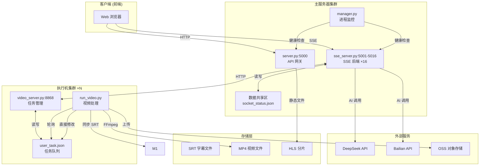
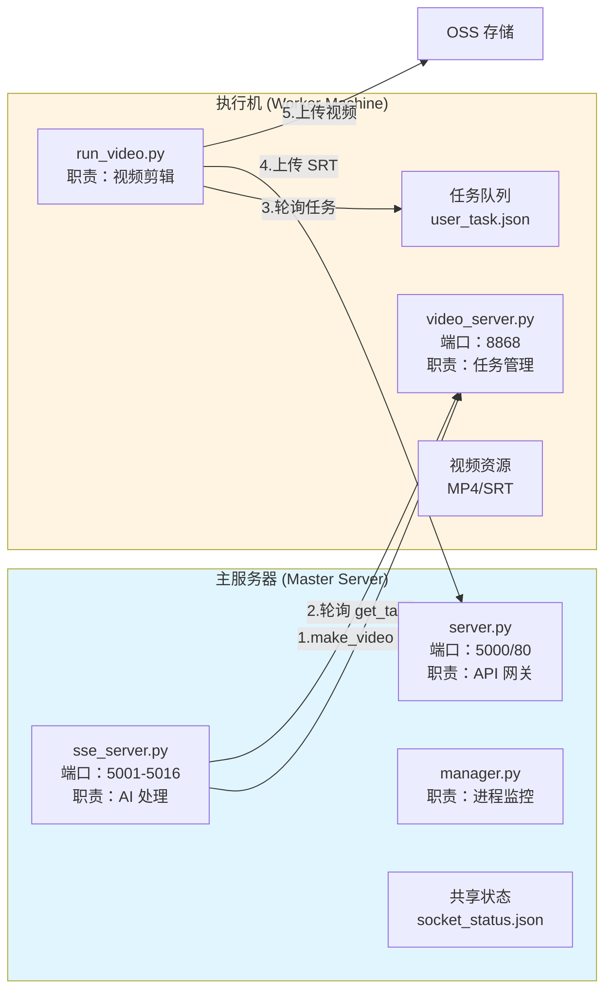
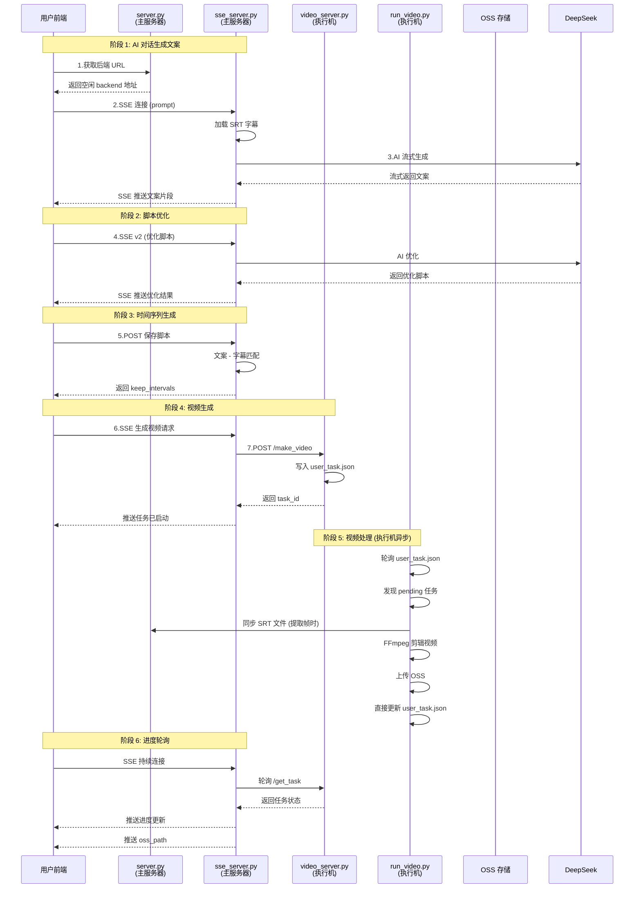
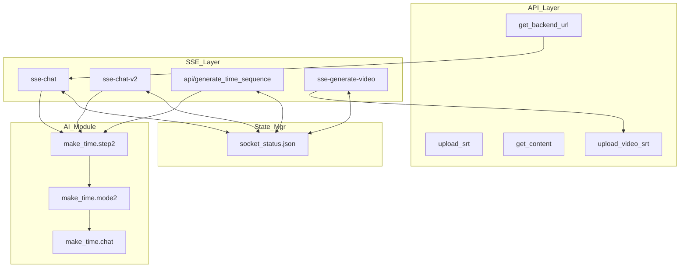
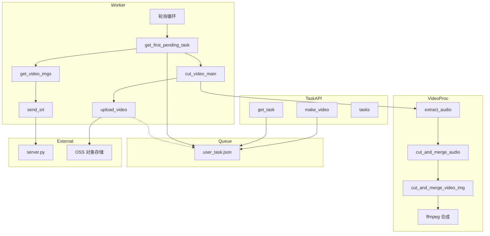
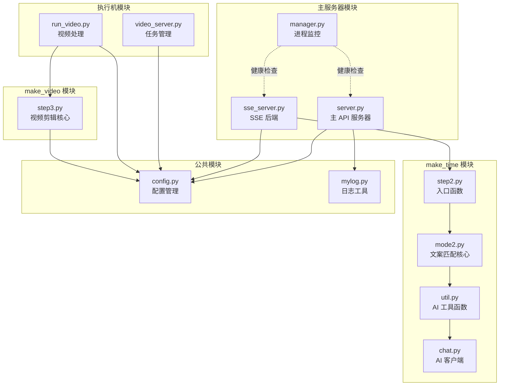
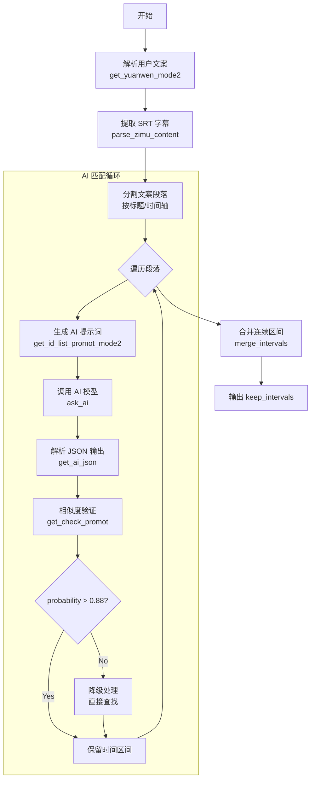
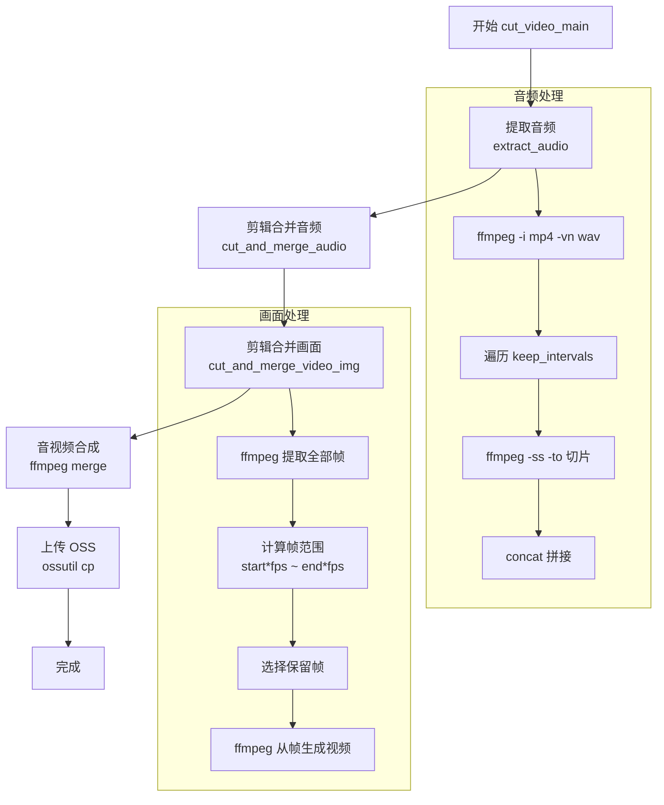
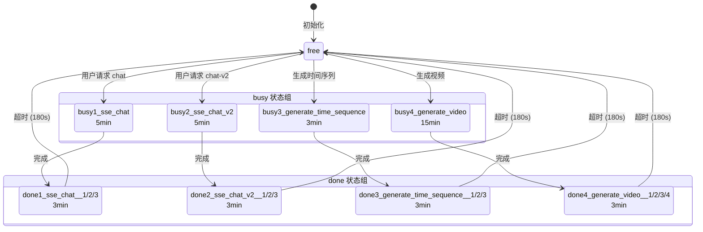
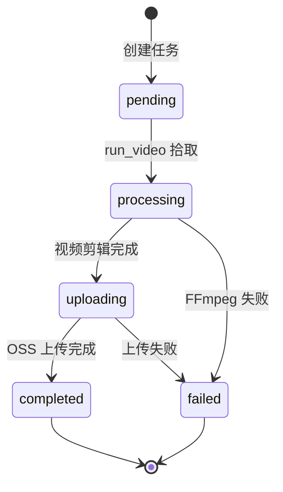

# 智能视频分割系统 - 完整技术架构文档

## 1. 工程概述

### 1.1 项目简介

智能视频分割系统是一个基于 Flask 的 Web 服务平台，通过 AI 大模型分析视频字幕内容，根据用户提供的脚本/文案自动生成精确剪辑的视频片段。系统采用**主从架构**，支持多执行机并行处理请求。

### 1.2 系统角色划分

```
┌─────────────────────────────────────────────────────────────────────────┐
│                           主服务器 (Master)                              │
│  运行组件：server.py, sse_server.py, manager.py                          │
│  职责：API 网关、用户请求接收、AI 对话、状态管理、任务分发                │
└─────────────────────────────────────────────────────────────────────────┘
                                   │
                                   │ HTTP 请求
                                   ▼
┌─────────────────────────────────────────────────────────────────────────┐
│                         执行机 (Worker) × N                              │
│  运行组件：video_server.py, run_video.py                                 │
│  职责：视频任务队列管理、FFmpeg 视频剪辑、OSS 上传                       │
└─────────────────────────────────────────────────────────────────────────┘
```

### 1.3 技术栈

| 层次 | 技术组件 |
|------|----------|
| Web 框架 | Flask + Flask-CORS |
| AI 模型 | DeepSeek API / 通义千问 (Bailian) |
| 视频处理 | FFmpeg / FFprobe |
| 实时通信 | SSE (Server-Sent Events) |
| 任务队列 | JSON 文件 + 轮询机制 |
| 日志系统 | Python logging (按天滚动) |
| 部署方式 | systemd 服务 (Linux) / 直接运行 (Windows) |
| 对象存储 | OSS (阿里云，仅 Linux) |

---

## 2. 系统架构总览

### 2.1 物理架构图



### 2.2 主服务器与执行机边界



**关键界限说明：**

| 职责 | 主服务器 | 执行机 |
|------|---------|-------|
| 用户认证 | ✅ | ❌ |
| AI 对话 (SSE) | ✅ | ❌ |
| 文案 - 字幕匹配 | ✅ | ❌ |
| 任务队列管理 | ❌ | ✅ |
| FFmpeg 视频剪辑 | ❌ | ✅ |
| OSS 上传 | ❌ | ✅ |
| 进程监控 | ✅ | ❌ |
| SRT 同步 | 接收端 | 发送端 (提取帧时) |

### 2.3 关键数据流向说明

```
┌─────────────────────────────────────────────────────────────────────────┐
│  重要澄清：视频生成请求的发起者                                         │
├─────────────────────────────────────────────────────────────────────────┤
│  ❌ 错误理解：server.py → video_server.py                               │
│  ✅ 正确理解：sse_server.py → video_server.py                           │
│                                                                         │
│  原因：sse_server.py 中的 sse_generate_video() 函数直接 HTTP 调用       │
│  执行机的 /make_video 端点，并持续轮询 /get_task 获取进度               │
└─────────────────────────────────────────────────────────────────────────┘

┌─────────────────────────────────────────────────────────────────────────┐
│  重要澄清：任务状态更新方式                                             │
├─────────────────────────────────────────────────────────────────────────┤
│  ❌ 错误理解：run_video.py 调用 video_server.py API 更新状态            │
│  ✅ 正确理解：run_video.py 直接修改 user_task.json 文件                 │
│                                                                         │
│  原因：run_video.py 的 update_task_status() 函数直接读写 JSON 文件，    │
│  使用 fcntl 文件锁保证并发安全，不调用 video_server.py 的任何 API        │
└─────────────────────────────────────────────────────────────────────────┘

┌─────────────────────────────────────────────────────────────────────────┐
│  重要澄清：SRT 文件同步时机                                             │
├─────────────────────────────────────────────────────────────────────────┤
│  执行机在 get_video_imgs() 提取视频帧时，调用 send_srt() 将 SRT 上传   │
│  到主服务器的 /upload_video_srt 端点，确保主服务器有最新的 SRT 文件    │
│  用于后续 AI 文案匹配                                                   │
└─────────────────────────────────────────────────────────────────────────┘
```

---

## 3. 数据流动图

### 3.1 完整业务流程



### 3.2 主服务器内部数据流



### 3.3 执行机内部数据流



---

## 4. 核心模块详解

### 4.1 模块依赖关系图



### 4.2 AI 字幕匹配流程



### 4.3 视频剪辑流程



---

## 5. 状态管理

### 5.1 后端状态流转 (socket_status.json)



### 5.2 任务状态流转 (user_task.json)



---

## 6. 关键 API 端点

### 6.1 主服务器 API (server.py:5000)

| 端点 | 方法 | 描述 |
|------|------|------|
| `/upload_srt` | POST | 上传 SRT 字幕文件 |
| `/download/<file_name>` | GET | 下载文件 |
| `/get_play_list` | POST | 获取播放列表 |
| `/submit_content` | POST | 提交弹幕/标签 |
| `/get_content` | POST | 获取弹幕/标签 |
| `/api/get_video_id_list` | POST | 获取视频 ID 列表 |
| `/upload_video_srt` | POST | 执行机上传 SRT |
| `/api/get_backend_url` | POST | 获取空闲后端地址 |

### 6.2 SSE 后端 API (sse_server.py:5001-5016)

| 端点 | 方法 | 描述 |
|------|------|------|
| `/{id}-{name}/sse-chat` | GET | SSE 流式对话 (阶段 1) |
| `/{id}-{name}/sse-chat-v2` | GET | SSE 流式对话 (阶段 2) |
| `/{id}-{name}/api/generate_time_sequence` | POST | 保存脚本生成时间序列 |
| `/{id}-{name}/sse-generate-video` | GET | SSE 视频生成 (阶段 4) |
| `/health_check` | GET | 健康检查 |

### 6.3 视频服务器 API (video_server.py:8868)

| 端点 | 方法 | 描述 |
|------|------|------|
| `/make_video` | POST | 创建视频任务 |
| `/get_task` | POST | 查询任务状态 |
| `/tasks` | GET | 获取任务列表 |
| `/health` | GET | 健康检查 |

---

## 7. 配置文件结构

### 7.1 socket_status.json (主服务器共享状态)

```json
{
  "001": {
    "status": "busy1_sse_chat",
    "user_id": "003",
    "cur_time": 1678888888,
    "update_time": "2026-03-08 10:00:00"
  },
  "002": {
    "status": "free",
    "user_id": null,
    "cur_time": 1678888000,
    "update_time": "2026-03-08 09:45:00"
  }
}
```

### 7.2 user_task.json (执行机任务队列)

```json
[
  {
    "video_id": "C1872",
    "user_id": "003",
    "keep_intervals": [[120.5, 135.2], [180.0, 200.5]],
    "created_at": "2026-03-08 10:00:00",
    "status": "processing",
    "oss_path": "http://video.kaixin.wiki/hanbing/.../C1872_003_..."
  }
]
```

---

## 8. 部署架构

### 8.1 主服务器部署

```bash
# server.py (API 网关)
python server.py  # Windows:5000  Linux:80

# sse_server.py (16 个实例)
python sse_server.py 5001 backend1 <backend_id> 001
python sse_server.py 5002 backend1 <backend_id> 002
...
python sse_server.py 5016 backend1 <backend_id> 016

# manager.py (进程监控)
python manager.py
```

### 8.2 执行机部署

```bash
# video_server.py (任务管理)
python video_server.py  # 端口 8868

# run_video.py (视频处理，可运行多个)
python run_video.py &
python run_video.py &
```

### 8.3 Linux systemd 配置

```ini
# /etc/systemd/system/backend1.service
[Unit]
Description=SSE Backend 1
After=network.target

[Service]
Type=simple
User=www-data
WorkingDirectory=/root/split_video
ExecStart=/usr/bin/python3 sse_server.py 5001 backend1 c0929290-6d79-40de-af54-e8aae8072060 001
Restart=always

[Install]
WantedBy=multi-user.target
```

---

## 9. 文件目录结构

```
split_video/
├── server.py                    # 主 API 服务器
├── sse_server.py                # SSE 后端
├── video_server.py              # 视频任务服务器 (执行机)
├── run_video.py                 # 视频处理工作进程 (执行机)
├── manager.py                   # 进程监控
├── config.py                    # 配置管理
├── mylog.py                     # 日志工具
├── make_time/                   # AI 字幕匹配模块
│   ├── step2.py                 # 入口函数
│   ├── mode2.py                 # 文案匹配核心
│   ├── util.py                  # AI 工具函数
│   └── chat.py                  # AI 客户端
├── make_video/                  # 视频处理模块
│   └── step3.py                 # 视频剪辑核心
├── data/                        # 数据目录
│   ├── hanbing/                 # 视频数据
│   │   ├── *.srt                # 字幕文件
│   │   ├── *.mp4                # 视频文件
│   │   └── *.json               # 元数据
│   └── config/                  # 配置文件
│       ├── socket_status.json   # 后端状态
│       └── config.yaml          # API 密钥
├── logs/                        # 日志目录
│   ├── app/                     # 主服务器日志
│   └── backend1/                # SSE 后端日志
└── video/                       # 视频输出
    ├── hls/                     # HLS 分片
    └── src/                     # 原始视频
```

---

## 10. 关键代码逻辑

### 10.1 后端分配逻辑 (server.py:get_backend_url)

```
1. 优先分配用户之前使用的 done 状态后端
2. 其次分配用户之前使用的 free 状态后端
3. 再次分配任意 free 状态后端
4. 最后分配 done 状态超时 (>180s) 的后端
```

### 10.2 文案 - 字幕匹配算法 (mode2.py)

```
1. 解析用户文案为结构化段落 (标题 + 时间轴 + 字幕)
2. 对每个字幕条目，生成 AI 提示词
3. AI 返回匹配的字幕 id_list
4. 调用 AI 验证相似度 (probability > 0.88)
5. 合并连续区间，输出 keep_intervals
```

### 10.3 视频剪辑算法 (step3.py)

```
1. 提取 MP4 音频为 WAV
2. 根据 keep_intervals 切割音频片段
3. 使用 ffmpeg concat 拼接音频
4. 提取视频全部帧 (30fps)
5. 根据 keep_intervals 选择保留帧
6. 从帧重新生成视频
7. 合并视频和音频
8. 上传 OSS
```

---

## 11. 安全与并发

### 11.1 文件锁机制

```python
# Linux 非阻塞文件锁
if not is_windows():
    fcntl.flock(f.fileno(), fcntl.LOCK_EX)  # 写锁
    fcntl.flock(f.fileno(), fcntl.LOCK_SH)  # 读锁
    fcntl.flock(f.fileno(), fcntl.LOCK_UN)  # 释放
```

### 11.2 安全验证

- `upload_token` 验证执行机上传请求
- 用户 `token` 验证前端请求
- 所有用户输入在文件操作前验证

---

## 12. 故障排查

### 12.1 常见问题

| 问题 | 检查点 |
|------|--------|
| SSE 连接中断 | 检查 Nginx `X-Accel-Buffering` 配置 |
| 视频生成超时 | 检查 `run_video.py` 进程状态 |
| 后端全忙 | 检查 `socket_status.json` 状态分布 |
| AI 调用失败 | 检查 API Key 和网络连接 |

### 12.2 日志位置

- 主服务器：`logs/app/log.txt`
- SSE 后端：`logs/backend1/*.txt`
- 系统日志：`journalctl -u backend1 -f`
