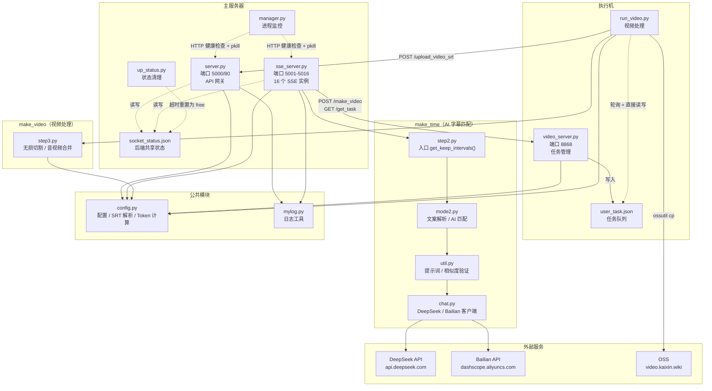
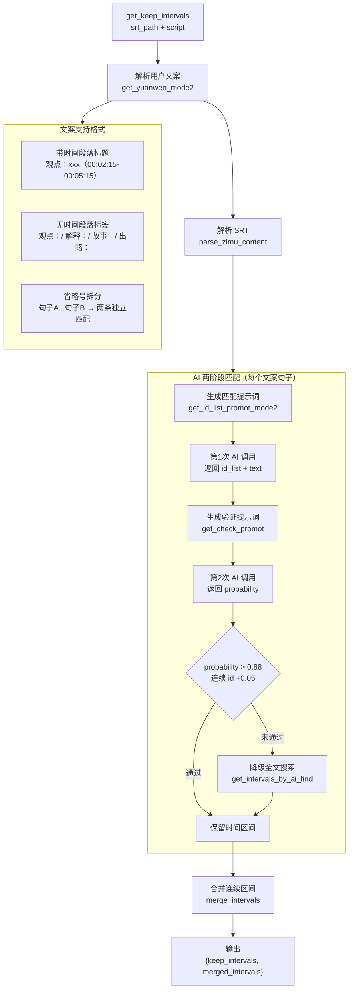
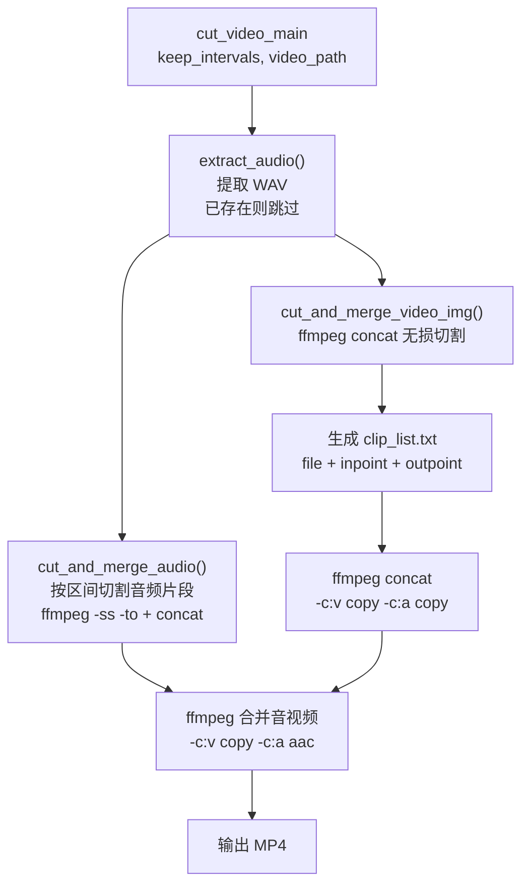
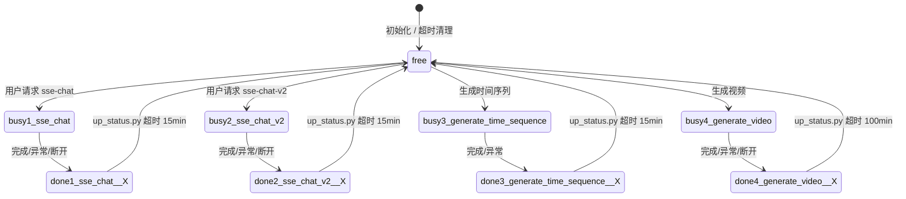
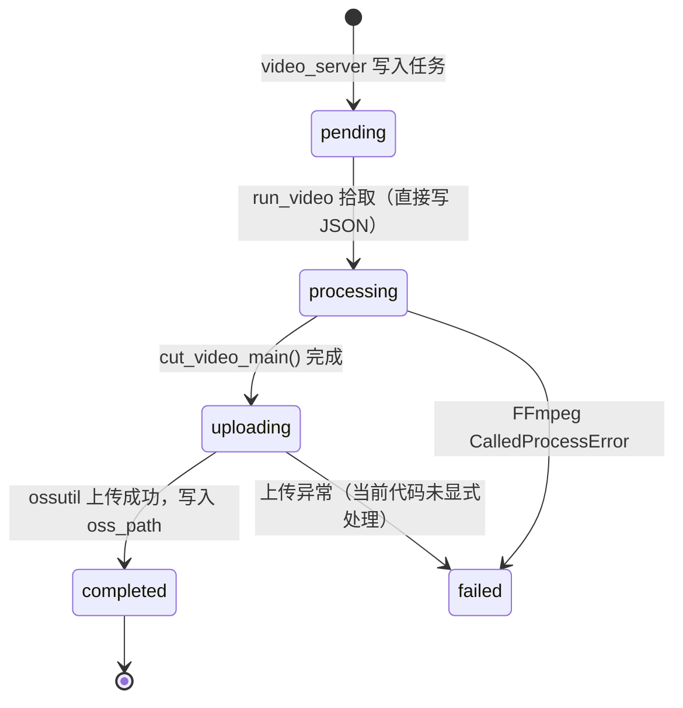

# 智能视频分割系统 - 系统设计文档

> 本文档由代码交叉验证生成，以代码为唯一事实依据。
> 覆盖 ARCHITECTURE.md 和 TECHNICAL_DOCS.md 全部内容，两者不再单独维护。
> 生成时间：2026-03-09

---

## 1. 概述

智能视频分割系统是基于 Flask 的 Web 服务平台，通过 AI 大模型分析视频字幕，根据用户提供的文案脚本自动生成精确剪辑的视频片段。

**核心能力：**
- SSE 流式 AI 对话生成文案（DeepSeek API）
- 文案与字幕两阶段 AI 智能匹配对齐
- 基于时间序列的 FFmpeg 无损视频剪辑
- 多后端负载均衡 + 分布式执行机处理

**技术栈：**

| 层次 | 技术组件 |
|------|----------|
| Web 框架 | Flask + Flask-CORS |
| AI 模型 | DeepSeek API / 阿里云 Bailian (通义千问) |
| 视频处理 | FFmpeg / FFprobe + ossutil |
| 实时通信 | SSE (Server-Sent Events) |
| 任务队列 | JSON 文件 + fcntl 文件锁 + 轮询 |
| 日志系统 | Python logging（TimedRotatingFileHandler，按天滚动）|
| 部署方式 | systemd（Linux）/ 直接运行（Windows 开发） |

---

## 2. 部署架构

### 2.1 物理架构

```
┌─────────────────────────────────────────────────────────────────┐
│                      主服务器 (Master)                           │
│                                                                  │
│  server.py (80/5000)     sse_server.py × 16 (5001-5016)         │
│  API 网关                SSE 后端（AI 处理）                     │
│                                                                  │
│  manager.py              up_status.py                            │
│  进程监控（pkill）        状态超时清理                            │
│                                                                  │
│  共享：./data/config/socket_status.json                          │
└──────────────────────────────┬──────────────────────────────────┘
                               │ HTTP (POST /make_video, GET /get_task)
                               ▼
┌─────────────────────────────────────────────────────────────────┐
│                   执行机 (Worker) × N                            │
│                                                                  │
│  video_server.py (8868)       run_video.py                       │
│  任务 API 管理                视频处理工作线程（轮询）            │
│                                                                  │
│  独立：user_task.json（各执行机独立维护）                        │
│  视频数据：./data/hanbing/**（SRT + MP4 + JSON）                 │
└─────────────────────────────────────────────────────────────────┘
                               │ ossutil cp
                               ▼
                    ┌─────────────────────┐
                    │   OSS 对象存储       │
                    │ video.kaixin.wiki    │
                    └─────────────────────┘
```

### 2.2 主从职责边界

| 职责 | 主服务器 | 执行机 |
|------|---------|--------|
| 用户认证（token 验证）| ✅ server.py | ❌ |
| AI 对话 / SSE 流式输出 | ✅ sse_server.py | ❌ |
| 文案-字幕 AI 匹配 | ✅ sse_server.py | ❌ |
| 后端负载均衡分配 | ✅ server.py | ❌ |
| 进程健康监控 | ✅ manager.py | ❌ |
| 状态超时清理 | ✅ up_status.py | ❌ |
| 视频任务 API 管理 | ❌ | ✅ video_server.py |
| FFmpeg 视频剪辑 | ❌ | ✅ run_video.py |
| OSS 上传 | ❌ | ✅ run_video.py |
| SRT 文件发送方 | 接收端（/upload_video_srt）| 发送端（get_new_video 时）|

### 2.3 模块依赖关系



---

## 3. 完整数据流（时序图）


> **关键说明**
> - `run_video.py` 通过 `update_task_status()` **直接读写** `user_task.json`，不调用 `video_server.py` 的任何 API
> - `sse_server.py` 发起 `/make_video` 请求，**不是** `server.py`
> - `run_video.py` 轮询 `video_list.json` 发现新视频时，调用 `send_srt()` 上传 SRT 到主服务器，此时帧提取命令处于注释状态，SRT 同步独立执行

---

## 4. 核心模块详解

### 4.1 server.py — API 网关

**后端分配逻辑** (`get_backend_url`)，优先级从高到低：

```
1. 该 user_id 已有 done 状态的后端（专属复用）
2. 该 user_id 已有 free 状态的后端
3. 任意 free 状态后端
4. done 状态超过 180 秒、且空闲最久的后端（抢占）
5. 以上均不满足 → 返回 backend_status=busy
```

### 4.2 sse_server.py — SSE 后端

每个实例通过命令行参数启动，路由动态绑定：

```bash
python sse_server.py [port] [backend_name] [backend_id] [backend_key]
# 示例：
python sse_server.py 5001 backend1 c0929290-6d79-40de-af54-e8aae8072060 001
```

- `backend_id`（UUID）+ `backend_name` 共同构成路由前缀：`/{backend_id}-{backend_name}/`
- `backend_key`（如 `001`）用于读写 `socket_status.json` 中的对应条目

### 4.3 make_time — AI 字幕匹配



**`keep_intervals` 数据格式（贯穿全流程）：**

```python
# merge_intervals() 输出 / user_task.json 存储格式
[
    [["00:01:00,000", "00:02:30,500"], "合并后的文本"],
    [["00:03:10,200", "00:04:05,800"], "下一段文本"],
]

# step3.ffmpeg_cut_mp4 内部转换为浮点秒后传入 cut_and_merge_*
# unit[0][0] → time_str_to_seconds() → float
```

### 4.4 make_video/step3.py — 视频处理

**当前实际流程（无损切割方案）：**



> **注意**：`cut_and_merge_img()`（帧提取旧方案）仍存在于文件中但未被调用，帧提取相关代码在 `run_video.py` 中也已注释。

### 4.5 run_video.py — 执行机工作线程

**主循环逻辑：**

```python
while True:
    get_new_video()          # 检测新视频 → 发送 SRT 到主服务器
    task = get_first_pending_task()
    if task:
        update_task_status(user_id, video_id, "processing")   # 直接写 JSON
        cut_video_main(keep_intervals, video_path, ...)
        update_task_status(user_id, video_id, "uploading")    # 直接写 JSON
        oss_path = upload_video(video_path, video_id, user_id)
        update_task_status(user_id, video_id, "completed", oss_path)
    time.sleep(10)
```

### 4.6 manager.py — 进程监控

```python
# manager.py 的实际行为
subprocess.run(["pkill", "-9", "-f", f"python3 {process_name}"])
time.sleep(30)
# 无 Popen / subprocess.Popen，依赖 systemd Restart=always 自动拉起
```

> **重要**：manager.py 只负责 `pkill` 杀死异常进程，不负责拉起新进程。依赖 systemd 的 `Restart=always` 配置完成重启。在非 systemd 环境（Windows 开发机）pkill 失败后进程不会被重新拉起。

### 4.7 up_status.py — 状态超时清理

每 **30 秒**扫描 `socket_status.json`，超时则重置为 `free`：

| 状态 | 超时阈值 |
|------|----------|
| `busy1/2/3` 或 `done1/2/3` | **15 分钟** |
| `busy4` 或 `done4` | **100 分钟** |

---

## 5. 状态管理

### 5.1 后端状态机（socket_status.json）



> `done` 状态的 `__X` 后缀（`__1` `__2` `__3`）区分正常完成、异常退出、finally 三种路径，超时阈值相同。

### 5.2 任务状态机（user_task.json）



> `run_video.py` 全程通过 `update_task_status()` 直接读写 `user_task.json`（含 fcntl 锁），不经过 `video_server.py` API。

---

## 6. API 端点

### 6.1 主服务器 server.py（端口 5000 / Linux:80）

| 端点 | 方法 | 说明 |
|------|------|------|
| `/api/get_backend_url` | POST | 按优先级分配 SSE 后端 URL |
| `/api/get_video_id_list` | POST | 获取可用视频列表 |
| `/upload_srt` | POST | 接收并保存 SRT 到 static/download/srt |
| `/upload_video_srt` | POST | 执行机上传 SRT（需 upload_token） |
| `/download/<file_name>` | GET | 下载文件 |
| `/get_play_list` | POST | 获取播放列表 |
| `/submit_content` | POST | 提交弹幕/标签 |
| `/get_content` | POST | 获取弹幕/标签 |
| `/health_check` | GET | 健康检查 → `{"status":"healthy"}` |

### 6.2 SSE 后端 sse_server.py（端口 5001-5016）

所有端点路径前缀：`/{backend_id}-{backend_name}/`

| 端点（相对路径）| 方法 | 说明 |
|----------------|------|------|
| `sse-chat` | GET | 阶段1：SSE 流式文案生成 |
| `sse-chat-v2` | GET | 阶段2：SSE 流式脚本优化 |
| `api/generate_time_sequence` | POST | 阶段3：字幕匹配，返回 keep_intervals |
| `sse-generate-video` | GET | 阶段4：SSE 视频生成进度流 |
| `/health_check` | GET | 健康检查（无路径前缀）|

### 6.3 执行机 video_server.py（端口 8868）

| 端点 | 方法 | 说明 |
|------|------|------|
| `/make_video` | POST | 创建/更新视频任务，写入 user_task.json |
| `/get_task` | POST | 查询任务状态（SSE 轮询用）|
| `/tasks` | GET | 全部任务列表（调试用）|
| `/health` | GET | 健康检查 → `{"code":200}` |

---

## 7. 配置文件格式

### 7.1 config.yaml（API 密钥）

```yaml
DEEPSEEK_API_KEY: sk-xxxx
BAILIAN_API_KEY:  sk-xxxx
```

### 7.2 config.json（用户与后端配置）

```json
{
  "token_list": ["user_token_1", "user_token_2"],
  "name_dic": {
    "001": "backend1",
    "002": "backend2"
  }
}
```

> `name_dic` 的值必须是纯后端名称（如 `"backend1"`），`server.py` 用 `name.split('backend')[1]` 计算端口偏移，不能包含 UUID 前缀。

### 7.3 socket_status.json（后端状态，主服务器）

```json
{
  "001": {
    "status": "free",
    "user_id": "002",
    "cur_time": 1741478400.0,
    "update_time": "2026-03-09 10:00:00"
  },
  "002": {
    "status": "busy1_sse_chat",
    "user_id": "003",
    "cur_time": 1741478500.0,
    "update_time": "2026-03-09 10:01:40"
  }
}
```

### 7.4 user_task.json（任务队列，执行机）

```json
[
  {
    "video_id": "C1872",
    "user_id": "003",
    "keep_intervals": [
      [["00:01:00,000", "00:02:30,500"], "因为在上市公司我 我做事做得很好"],
      [["00:03:10,200", "00:04:05,800"], "就是错把平台的能力当自己的能力"]
    ],
    "created_at": "2026-03-09 10:00:00",
    "status": "completed",
    "oss_path": "http://video.kaixin.wiki/hanbing/.../C1872_003_2026_03_09_10_30_00.mp4"
  }
]
```

> `keep_intervals` 每项格式为 `[[start_str, end_str], text]`，时间为 SRT 时间字符串。`step3.ffmpeg_cut_mp4()` 内部调用 `time_str_to_seconds()` 转换为浮点秒数后处理。

### 7.5 视频元数据（每个视频目录下的 .json）

```json
{
  "name": "视频显示名称"
}
```

> `config.py` 的 `get_file_info()` 读取此文件获取 `name` 字段，用于视频列表展示。

---

## 8. 部署说明

### 8.1 主服务器启动顺序

```bash
# 1. 主 API 服务（Windows:5000 / Linux:80）
python server.py

# 2. SSE 后端实例（参数：端口 名称 UUID 编号）
python sse_server.py 5001 backend1 c0929290-6d79-40de-af54-e8aae8072060 001
python sse_server.py 5002 backend2 <uuid2> 002
# ... 最多 16 个实例

# 3. 状态清理（每 30 秒）
python up_status.py

# 4. 进程监控（依赖 systemd 重启，pkill 后自动拉起）
python manager.py
```

### 8.2 执行机启动顺序

```bash
# 1. 任务管理 API
python video_server.py   # 端口 8868

# 2. 视频处理工作线程（可启动多个并发）
python run_video.py &
python run_video.py &
```

### 8.3 生产环境（Linux systemd）

```ini
# /etc/systemd/system/backend1.service
[Unit]
Description=SSE Backend 1
After=network.target

[Service]
User=root
WorkingDirectory=/root/split_video
ExecStart=/usr/bin/python3 sse_server.py 5001 backend1 c0929290-6d79-40de-af54-e8aae8072060 001
Restart=always
RestartSec=5

[Install]
WantedBy=multi-user.target
```

```bash
# 常用运维命令
systemctl status backend1
systemctl restart backend1
journalctl -u backend1 -f

# 批量生成 systemd 配置
python run_sse_code.py
```

### 8.4 执行机 IP 配置

```python
# sse_server.py 第18行
servers = ["113.249.107.180", "113.249.107.182"]
```

`sse_generate_video()` 遍历 `servers` 列表，选取第一个成功响应的执行机执行视频任务。

---

## 9. 故障排查

### 9.1 常见问题

| 现象 | 检查点 |
|------|--------|
| SSE 连接立即断开 | Nginx 配置 `X-Accel-Buffering: no` |
| 后端全部 busy | 查看 `socket_status.json`；`up_status.py` 是否运行 |
| 视频生成无进度 | 执行机 `run_video.py` 是否运行；`user_task.json` 中 status |
| AI 匹配返回空结果 | `config.yaml` 中 API Key 是否有效；查看 backend 日志 |
| keep_intervals 全为 null | `probability < 0.88` 且降级也失败；检查 SRT 文件与文案是否匹配 |
| 视频上传失败 | 执行机上 ossutil 是否配置；查看 `user_task.json` status=uploading 是否卡住 |
| manager.py 重启后服务未起 | 确认 systemd 中配置了 `Restart=always`；Windows 环境 manager 无法重启进程 |

### 9.2 日志位置

| 服务 | 日志路径 |
|------|----------|
| server.py | `logs/app/log.txt` |
| sse_server backend1 | `logs/backend1/backend1.txt` |
| systemd 服务 | `journalctl -u backend1 -f` |
| 执行机 | 控制台 stdout（可重定向到文件）|

### 9.3 状态手动重置

```bash
# 手动将某个后端重置为 free（修改 socket_status.json）
# 将 "001" 的 status 改为 "free"
# up_status.py 会在 15/100 分钟后自动清理，也可手动编辑
```

---

*文档基于代码交叉验证生成，已修正原文档10处错误。如需更新，请以代码为准重新生成。*
