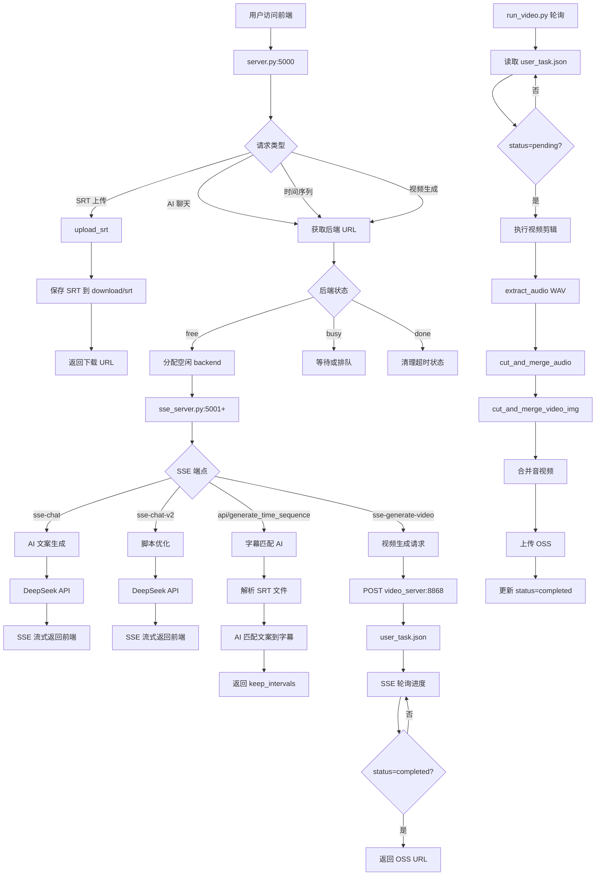
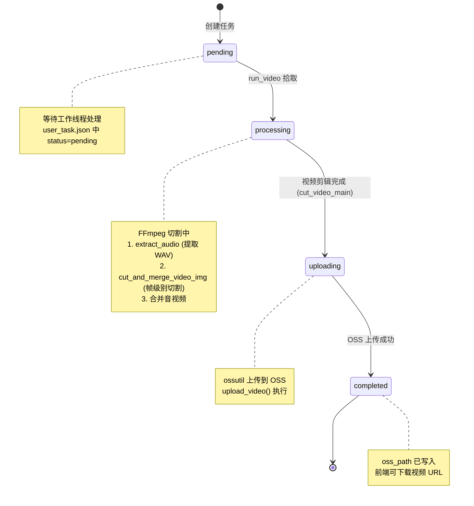
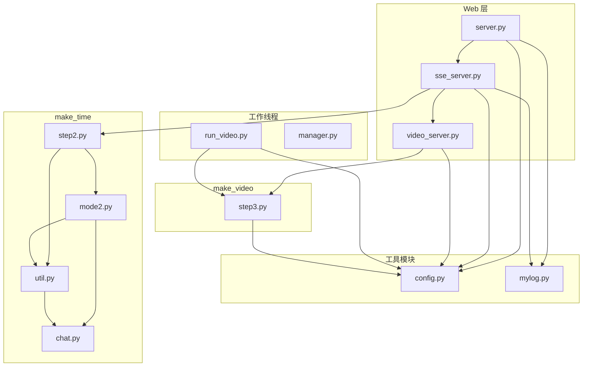
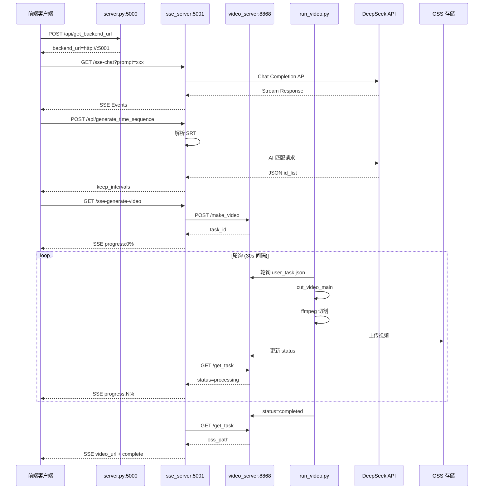

# 智能视频分割系统 - 技术文档

## 1. 工程概述

### 1.1 项目简介

智能视频分割系统是一个基于 Flask 的 Web 服务平台，通过 AI 大模型分析视频字幕内容，根据用户提供的脚本/文案自动生成精确剪辑的视频片段。系统采用微服务架构，支持多后端实例并行处理请求。

**核心能力：**
- AI 聊天对话生成文案（SSE 流式输出）
- 文案与字幕智能匹配对齐
- 基于时间序列的视频自动剪辑
- 多任务队列和分布式处理

### 1.2 技术栈

| 层次 | 技术组件 |
|------|----------|
| Web 框架 | Flask + Flask-CORS |
| AI 模型 | DeepSeek API / 通义千问 (Bailian) |
| 视频处理 | FFmpeg / FFprobe |
| 实时通信 | SSE (Server-Sent Events) |
| 任务队列 | JSON 文件 + 轮询机制 |
| 日志系统 | Python logging (按天滚动) |
| 部署方式 | systemd 服务 (Linux) / 直接运行 (Windows) |

### 1.3 系统架构

```
┌─────────────────────────────────────────────────────────────────────────┐
│                           客户端 (前端)                                  │
└─────────────────────────────────────────────────────────────────────────┘
                                    │
                                    ▼
┌─────────────────────────────────────────────────────────────────────────┐
│                      API 网关层 (server.py:5000)                        │
│  - 静态资源服务  - SRT 文件上传  - 后端路由分发  - 用户认证              │
└─────────────────────────────────────────────────────────────────────────┘
                                    │
            ┌───────────────────────┼───────────────────────┐
            ▼                       ▼                       ▼
    ┌───────────────┐       ┌───────────────┐       ┌───────────────┐
    │ backend1-16   │       │ backend1-16   │       │ backend1-16   │
    │ sse_server    │       │ sse_server    │       │ sse_server    │
    │ (5001-5016)   │       │ (5001-5016)   │       │ (5001-5016)   │
    │               │       │               │       │               │
    │ - SSE 聊天    │       │ - 时间序列    │       │ - 视频生成    │
    │ - 文案生成    │       │ - 字幕匹配    │       │ - 状态轮询    │
    └───────────────┘       └───────────────┘       └───────────────┘
            │                       │                       │
            └───────────────────────┼───────────────────────┘
                                    ▼
                    ┌───────────────────────────────┐
                    │  video_server.py (8868)       │
                    │  - 视频任务管理               │
                    │  - 任务队列维护               │
                    └───────────────────────────────┘
                                    │
                                    ▼
                    ┌───────────────────────────────┐
                    │  run_video.py (工作线程)      │
                    │  - 轮询待处理任务             │
                    │  - FFmpeg 视频剪辑            │
                    │  - OSS 上传                   │
                    └───────────────────────────────┘
```

---

## 2. 核心模块说明

### 2.1 模块职责

| 文件 | 端口 | 职责 |
|------|------|------|
| `server.py` | 5000/80 | 主 API 服务器 - 文件上传下载、用户认证、后端路由 |
| `sse_server.py` | 5001+ | SSE 后端 - AI 聊天、时间序列生成、视频生成请求 |
| `video_server.py` | 8868 | 视频任务管理 - 任务队列、状态追踪 |
| `run_video.py` | - | 视频处理工作线程 - 轮询任务并执行 FFmpeg |
| `manager.py` | - | 进程健康监控 - 自动重启失败服务 |
| `config.py` | - | 配置管理 - API 密钥、SRT 解析、Token 计算 |
| `mylog.py` | - | 日志工具 - 统一的日志设置 |

### 2.2 make_time 模块 (AI 字幕匹配)

```
make_time/
├── step2.py      # 入口函数 get_keep_intervals()
├── mode2.py      # 文案解析和 AI 匹配核心逻辑
├── util.py       # AI 提示词生成、JSON 解析、时间轴处理
└── chat.py       # 多模型 AI 客户端 (DeepSeek/Bailian)
```

**核心流程：**
1. 解析用户文案为结构化段落
2. 提取 SRT 字幕为时间戳列表
3. 调用 AI 匹配文案句子到字幕片段
4. 相似度验证 (probability 校验)
5. 合并连续片段生成最终时间区间

### 2.3 make_video 模块 (视频处理)

```
make_video/
└── step3.py      # 视频剪辑核心逻辑
```

**处理流程：**
1. 提取 WAV 音频
2. 提取视频帧 (30fps)
3. 按时间区间切割音频
4. 按帧范围切割图片
5. 重组图片为视频
6. 合并音视频
7. 上传至 OSS

---

## 3. 数据流动

### 3.1 完整业务流程图



### 3.2 状态流转图



**状态更新流程 (run_video.py 主循环)**:
```
update_task_status(user_id, video_id, "processing")  # 开始处理
  → cut_video_main()                                  # 执行 FFmpeg
  → update_task_status(user_id, video_id, "uploading") # 开始上传
  → upload_video()                                    # ossutil 上传
  → update_task_status(user_id, video_id, "completed", oss_path) # 完成
```

---

## 4. 代码逻辑关系

### 4.1 模块依赖关系图



### 4.2 API 调用时序图



---

## 5. 关键路径说明

### 5.1 路径 1: AI 文案生成 (sse-chat)

```
前端 → server.py (获取后端) → sse_server.py → DeepSeek API → SSE 返回
```

**关键代码：**
- `sse_server.py:168-247` - sse_chat() 端点
- `sse_server.py:127-157` - llm_generate_stream() 流式生成
- `chat.py:10-60` - ask_ai() 多模型路由

**状态变更：**
`free` → `busy1_sse_chat` → `done1_sse_chat__1/2/3`

### 5.2 路径 2: 时间序列生成 (字幕匹配)

```
前端提交文案 → sse_server.py → 解析 SRT → AI 匹配 → 返回 keep_intervals
```

**关键代码：**
- `sse_server.py:588-643` - save_script() 端点
- `make_time/step2.py:39-43` - get_keep_intervals()
- `make_time/mode2.py:349-352` - get_intervals_by_mode2()
- `make_time/mode2.py:12-105` - get_yuanwen_mode2() 文案解析
- `make_time/mode2.py:272-296` - get_intervals_by_ai_mode2() AI 匹配
- `make_time/util.py:265-293` - get_unit_interval_by_ai() 相似度校验

**状态变更：**
`free` → `busy3_generate_time_sequence` → `done3_...`

### 5.3 路径 3: 视频生成

```
前端 → sse_server → video_server (创建任务) → run_video 轮询 → FFmpeg → OSS
```

**关键代码：**
- `sse_server.py:355-575` - sse_generate_video() SSE 流
- `video_server.py:64-167` - make_video() 创建任务
- `run_video.py:208-225` - 主循环轮询
- `run_video.py:218-224` - cut_video_main + upload_video
- `make_video/step3.py:355-361` - cut_video_main()
- `make_video/step3.py:313-337` - ffmpeg_cut_mp4()

**状态变更：**
`pending` → `processing` → `uploading` → `completed`

**SSE 进度轮询：**
```
progress:0 → waiting... (30s 间隔)
→ pending:排队中...
→ processing:正在生成中... (retry_i++)
→ uploading:视频上传中...
→ 100%:视频已生成完成 + video_url
```

---

## 6. 配置文件结构

### 6.1 config.yaml (API 密钥)

```yaml
DEEPSEEK_API_KEY: sk-xxxx
BAILIAN_API_KEY: sk-xxxx
```

### 6.2 config.json (用户配置)

```json
{
  "token_list": ["token1", "token2", ...],
  "name_dic": {
    "001": "c0929290...-backend1",
    "002": "...-backend2",
    ...
  }
}
```

### 6.3 socket_status.json (后端状态)

```json
{
  "001": {
    "status": "free|busy1_sse_chat|done1_sse_chat__1|...",
    "cur_time": 1709712345.678,
    "user_id": "001",
    "update_time": "2026-03-07 10:30:45"
  }
}
```

### 6.4 user_task.json (视频任务队列)

```json
[
  {
    "video_id": "C1872",
    "user_id": "001",
    "keep_intervals": [["00:01:00,000", "00:02:30,500"], ...],
    "created_at": "2026-03-07 10:00:00",
    "status": "pending|processing|uploading|completed",
    "oss_path": "http://video.kaixin.wiki/..."
  }
]
```

---

## 7. 核心数据结构

### 7.1 SRT 解析结构

```python
# zimu_list 格式
[
    [序号，[开始时间，结束时间], 文本],
    [104, ["00:03:25,100", "00:03:27,833"], "真正的你要知道敌人是什么"],
    ...
]
```

### 7.2 keep_intervals 结构

```python
# 时间区间列表 (时间字符串格式)
[
    [cut_start, cut_end, id_list, yuan_text, zimu_mode],
    ["00:01:00,000", "00:02:30,500", [100,101,102], "原文句子", 0],
    ...
]

# 合并后的结构 (用于 FFmpeg)
[
    [[start, end], text],
    [["00:01:00,000", "00:02:30,500"], "合并的文本"],
    ...
]
```

### 7.3 文案解析结构 (yuanwen)

```python
[
    {
        'part_name': '观点',
        'part_text': '企业扩张时要学会就地取材',
        'part_time': ['00:01:00', '00:02:00'],
        'zimu_list': [
            {'time_text': '00:01:00,000 --> 00:01:05,000',
             'start': '00:01:00,000',
             'end': '00:01:05,000',
             'text': '企业扩张时'}
        ]
    }
]
```

---

## 8. 部署架构

### 8.1 systemd 服务配置

```ini
# /etc/systemd/system/backend1.service
[Unit]
Description=Backend Server 1
After=network.target

[Service]
User=root
WorkingDirectory=/root/ttt
ExecStart=/usr/bin/python3 sse_server_backend1.py
Restart=always
RestartSec=5

[Install]
WantedBy=multi-user.target
```

### 8.2 服务列表

| 服务名 | 端口 | 数量 |
|--------|------|------|
| app/server | 80/5000 | 1 |
| sse_server | 5001-5016 | 16 |
| video_server | 8868 | 1-2 |
| run_video | - | 1-2 |
| manager | - | 1 |
| up_status | - | 1 |

---

## 9. 性能优化点

### 9.1 Token 分割
当 SRT 文件超过 `limit_prompt (8192 tokens)` 时自动分割为多个部分处理。

### 9.2 文件锁机制
Linux 上使用 `fcntl.flock()` 实现 JSON 文件的并发访问控制。

### 9.3 后端负载均衡
通过 `socket_status.json` 实现请求分发：
1. 优先分配用户专属后端
2. 其次分配空闲后端
3. 最后分配完成时间最久的 busy 后端

### 9.4 FFmpeg 优化
- 使用无损切割避免重新编码
- 帧级别精确剪辑
- 先切割后合并策略

---

## 10. 错误处理

### 10.1 AI API 错误
- DeepSeek 调用失败时返回错误 SSE 事件
- 相似度校验失败 (probability < 0.88) 时标记为无效区间

### 10.2 任务队列错误
- JSONDecodeError 时初始化为空数组/字典
- 文件锁获取失败时抛出 RuntimeError

### 10.3 视频处理错误
- FFmpeg 命令失败时抛出 CalledProcessError
- OSS 上传失败时保持任务状态为 uploading

---

## 11. 监控与维护

### 11.1 健康检查端点
- `GET /health_check` - server.py
- `GET /health_check` - sse_server.py (各 backend)
- `GET /health` - video_server.py

### 11.2 日志文件
- `logs/app/log.txt` - 主服务器日志
- `logs/backendN/backendN.txt` - 各后端日志
- `/var/log/backend/*.log` - systemd 服务日志

### 11.3 自动重启
`manager.py` 每 2 秒检查各服务健康状态，失败时自动重启。

`up_status.py` 每 30 秒清理超时任务状态 (busy4 超过 100 分钟/其他超过 15 分钟)。

---

## 附录 A：API 端点汇总

| 端点 | 方法 | 服务器 | 说明 |
|------|------|--------|------|
| `/upload_srt` | POST | server.py | 上传 SRT 文件 |
| `/api/get_backend_url` | POST | server.py | 获取后端 URL |
| `/{id}-{name}/sse-chat` | GET | sse_server | AI 聊天流 |
| `/{id}-{name}/sse-chat-v2` | GET | sse_server | 脚本优化流 |
| `/{id}-{name}/api/generate_time_sequence` | POST | sse_server | 生成时间序列 |
| `/{id}-{name}/sse-generate-video` | GET | sse_server | 视频生成流 |
| `/make_video` | POST | video_server | 创建视频任务 |
| `/get_task` | POST | video_server | 查询任务状态 |
| `/tasks` | GET | video_server | 任务列表 |

---

*文档生成时间：2026-03-07*
