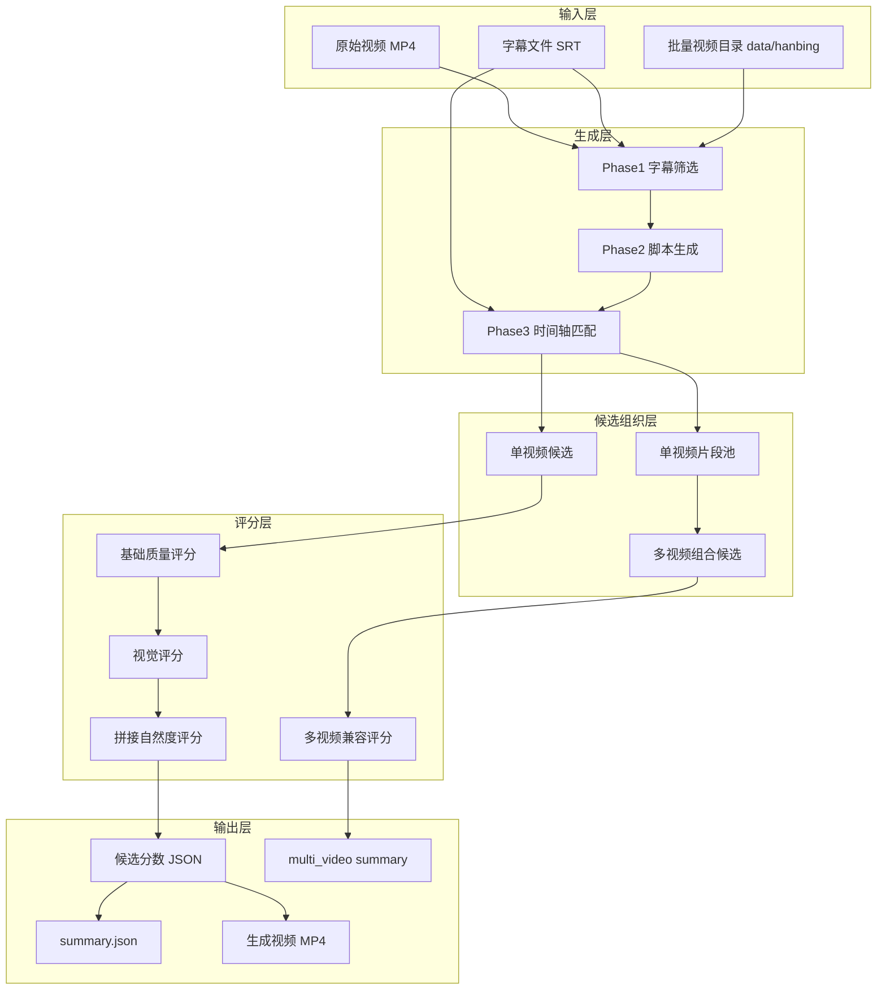
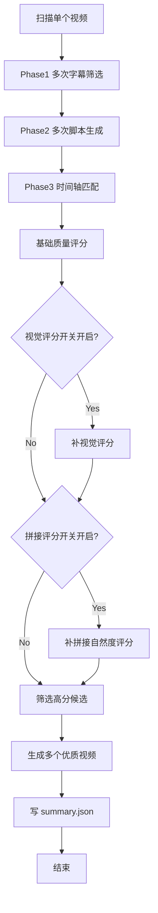
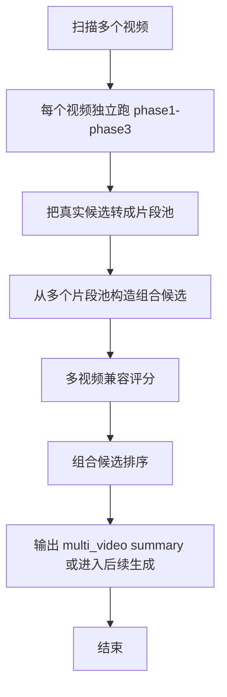

# sp_video - 批量短视频生成系统架构文档

## 1. 工程概述

### 1.1 项目简介

`sp_video` 是一个从长视频和字幕中自动生成高质量短视频候选的本地批处理系统。

系统当前已经从早期的：

- 单视频 CLI 自动剪辑

演进为：

- 单视频批量候选生成
- 候选评分与筛选
- 视觉质量补评分
- 拼接自然度补评分
- 向多视频组合生成继续演进

它当前的核心目标不是只产出 1 条视频，而是：

- 从一个或多个原始视频中生成多个候选
- 自动做内容、结构、画面层面的筛选
- 输出多个相对优质的视频结果或高分候选

### 1.2 当前系统定位

当前系统更接近：

**自动短视频候选生成与筛选引擎**

而不只是一个简单的“输入脚本 -> 剪 1 条视频”的工具。

### 1.3 当前技术栈

| 层次 | 技术组件 |
|------|----------|
| 主语言 | Python |
| AI 模型 | Qwen / DashScope / 兼容调用封装 |
| 视频处理 | FFmpeg |
| 图片处理 | PIL / 抽帧 + 九宫格 |
| 批处理 | 本地顺序执行 |
| 存储 | 本地文件系统 + JSON / JSONL |
| 测试 | pytest |

---

## 2. 系统架构总览

### 2.1 当前逻辑架构图



### 2.2 两种工作模式

当前系统在架构上分成两种模式：

| 模式 | 说明 |
|------|------|
| 单视频模式 | 一个视频独立生成多个候选，评分后输出多个优质视频 |
| 多视频模式 | 多个视频各自产生片段池，再组合成跨视频候选 |

### 2.3 当前核心入口

当前主入口是：

- `batch_generator.py`

它负责：

- 扫描视频数据
- 驱动 Phase1 -> Phase5
- 管理评分和筛选
- 在配置开关开启时进入多视频模式

---

## 3. 核心业务目标

### 3.1 单视频目标

对一个视频：

1. 多次生成字幕筛选结果
2. 多次生成脚本结果
3. 多次匹配时间轴
4. 对候选结果评分
5. 只输出评分足够高的多个视频结果

### 3.2 多视频目标

对多个视频：

1. 每个视频先形成自己的候选片段池
2. 从多个池中组合出新的候选
3. 对组合候选做基础兼容评分
4. 逐步演进到可输出跨视频高质量候选或最终视频

### 3.3 评估标准

当前系统希望优先产出：

- 文本结构相对完整
- 画面质量不差
- 拼接不太碎
- 节奏较合理
- 在多视频场景下，主题和切换不明显失控

---

## 4. 数据流动图

### 4.1 单视频批量生成主流程



### 4.2 多视频组合流程



### 4.3 候选筛选逻辑


---

## 5. 核心模块说明

### 5.1 入口与配置层

#### `batch_generator.py`

职责：

- 当前系统主入口
- 管理单视频/多视频模式分支
- 串起 Phase1-Phase5
- 驱动评分和生成流程

#### `settings.py`

职责：

- 统一管理批量生成相关配置
- 控制候选生成数量、评分开关、阈值等

关键配置：

- `BATCH_PHASE1_COUNT`
- `BATCH_PHASE2_COUNT`
- `BATCH_SCORE_THRESHOLD`
- `BATCH_VISUAL_ENABLE`
- `BATCH_TRANSITION_ENABLE`
- `BATCH_MULTI_VIDEO_ENABLE`

### 5.2 Phase 执行层

#### `batch/phase_runner.py`

职责：

- 批量执行 Phase1 / Phase2 / Phase3
- 复用旧的单视频能力
- 将批处理入口与具体实现隔离开

核心函数：

- `run_phase1_loop()`
- `run_phase2_loop()`
- `run_phase3_loop()`

### 5.3 时间轴识别层

#### `make_time/step2.py`

职责：

- 对外暴露 `get_keep_intervals()`
- 是脚本到时间序列的主入口

#### `make_time/mode2.py`

职责：

- 脚本文本解析
- 文案结构拆分
- 驱动 AI 匹配字幕

#### `make_time/ai_caller.py` / `chat.py` / `prompts.py`

职责：

- 构造提示词
- 调用 AI 模型
- 验证匹配质量

### 5.4 视频生成层

#### `make_video/step3.py`

职责：

- 当前单视频输出主函数
- 根据 `keep_intervals` 调用 FFmpeg 生成视频

当前定位：

- 这是当前最稳定的“单视频最终输出层”
- 多视频模式最终是否直接复用它，是当前仍在演进中的架构点

### 5.5 基础评分层

#### `batch/evaluator.py`

职责：

- 给候选一个基础质量评分
- 当前是总评分体系的底座

### 5.6 视觉评分层

#### `batch/frame_sampler.py`

职责：

- 从候选片段中抽帧

#### `batch/image_grid.py`

职责：

- 把多张图拼成固定九宫格

#### `batch/visual_scorer.py`

职责：

- 调用视觉评分逻辑
- 给候选补 `visual_score`
- 把视觉分合并回总分

### 5.7 拼接自然度评分层

#### `batch/transition_scorer.py`

职责：

- 根据 `intervals` 本身判断候选是否太碎、太跳
- 生成规则版 `transition_natural` 分数

### 5.8 多视频组合层

#### `batch/multi_video_selector.py`

职责：

- 定义多视频输入结构
- 负责主/副视频的最小选择策略

#### `batch/video_pool_builder.py`

职责：

- 把每个视频的候选结果转换成片段池
- 为跨视频组合提供统一数据结构

#### `batch/video_combiner.py`

职责：

- 从多个视频池中构造多视频候选
- 当前只做最简单双视频组合

#### `batch/multi_video_scorer.py`

职责：

- 对多视频候选做兼容评分
- 当前只做基础规则评分

---

## 6. 关键数据结构

### 6.1 旧稳定结构：`keep_intervals`

这是当前系统里最稳定的底层结构之一。

```python
[
  [("00:00:01,000", "00:00:05,000"), "文本1"],
  [("00:00:08,000", "00:00:12,000"), "文本2"],
  [(None, None), "未匹配文本"]
]
```

用途：

- Phase3 的真实输出
- 单视频视频生成的真实输入

### 6.2 单视频评分结构

```python
{
  "count": 2.5,
  "duration": 2.0,
  "dedup": 1.8,
  "transition": 1.5,
  "total": 7.8,
  "visual": 7.2,
  "transition_natural": 8.1
}
```

### 6.3 多视频片段结构（目标结构）

```python
{
  "video_id": "A001",
  "start": "00:00:01,000" 或 1.0,
  "end": "00:00:05,000" 或 5.0,
  "text": "字幕内容",
  "base_score": 7.8,
  "interval_idx": 0
}
```

### 6.4 多视频候选结构

```python
{
  "candidate_id": "C001",
  "segments": [...],
  "main_segments": [...],
  "sub_segments": [...],
  "main_video_id": "A001",
  "sub_video_id": "B002"
}
```

---

## 7. 当前系统的核心设计原则

### 7.1 先批量生成，再做筛选

系统不是先假设只有一个“正确答案”，而是：

- 先批量生成候选
- 再用评分层筛选出更优结果

### 7.2 单视频能力作为稳定基座

当前最稳定的能力来自：

- Phase1-3 的单视频链路
- `keep_intervals`
- `cut_video_main()`

所以新能力不应该轻易推翻这些基础，而应该建立在它们之上。

### 7.3 多评分层叠加，而不是单点评价

当前评分体系分层累加：

1. 基础质量评分
2. 视觉评分
3. 拼接自然度评分
4. 多视频兼容评分

这样做的目的，是减少单个评分器误判整个候选的风险。

### 7.4 当前阶段优先最小可联通骨架

当前阶段对多视频的原则不是一步做到很智能，而是：

- 先接通
- 先可读
- 先能收敛
- 再逐步增强

---

## 8. 当前输出结构

### 8.1 单视频输出目录

```text
data/batch_results/{video_id}/
├── phase1/
├── phase2/
├── phase3/
├── phase4/
├── phase5/
├── visual/
└── summary.json
```

### 8.2 多视频输出目录

当前目标目录：

```text
data/batch_results/multi_video/
├── summary_C001.json
└── video_C001.mp4   # 如果当前阶段支持最终输出
```

### 8.3 当前结果类型

当前系统希望保留两类结果：

1. **候选级结果**
   - score json
   - summary json
   - multi_video summary

2. **最终视频结果**
   - 单视频模式下生成多个高分视频
   - 多视频模式下逐步演进到可生成跨视频成片

---

## 9. 当前架构风险点

### 9.1 多视频和旧 `keep_intervals` 结构的对齐

这是当前最关键的技术风险点。

问题在于：

- 单视频链路稳定地使用 `keep_intervals`
- 多视频层希望使用更适合组合的 `segment` 结构

如果转换层设计不好，后面会出现：

- 数据契约冲突
- 多层重复适配
- 输出层难收口

### 9.2 多视频最终输出层仍未完全稳定

当前单视频输出能力已经稳定，
但多视频最终输出是否：

- 直接复用旧出口
- 增加新的多输入视频出口
- 先只输出 summary 不产成片

这是仍在收敛中的架构边界。

### 9.3 评分层继续增多时的复杂度控制

当前评分层已经变成多层结构。

后续如果继续增加：

- 更重的视觉判断
- 更复杂的跨视频一致性判断
- 更复杂的导演策略

就很容易失控。

所以当前架构必须坚持：

- 评分器职责单一
- 不把所有逻辑揉进一个巨型 evaluator

---

## 10. 当前推荐演进方向

### 10.1 近期方向

近期最值得继续推进的是：

1. 修通第三阶段多视频主链路
2. 明确 `keep_intervals -> segment` 转换层
3. 决定多视频最小闭环停在：
   - 候选 summary
   - 还是最终视频输出

### 10.2 中期方向

中期可以继续增强：

1. 多视频真正输出层
2. 更稳的跨视频兼容评分
3. 多个优质视频自动去重
4. 更合理的 top-N 候选保留策略

### 10.3 长期方向

长期可以演进成：

- 自动短视频编排引擎
- 支持多视频主题编排
- 支持更多风格模板
- 支持基于历史高分结果反推权重调整

---

## 11. 代码目录结构

```text
sp_video/
├── batch_generator.py              # 当前主入口
├── settings.py                     # 全局配置
├── main.py                         # 旧 CLI 主流程
├── skill.py                        # 智能体接口流程
├── batch/
│   ├── logger.py                   # 批处理日志
│   ├── phase_runner.py             # Phase1-3 批量执行
│   ├── evaluator.py                # 基础质量评分
│   ├── frame_sampler.py            # 抽帧
│   ├── image_grid.py               # 九宫格拼图
│   ├── visual_scorer.py            # 视觉评分
│   ├── transition_scorer.py        # 拼接自然度评分
│   ├── multi_video_selector.py     # 多视频输入与选择
│   ├── video_pool_builder.py       # 单视频片段池构建
│   ├── video_combiner.py           # 多视频组合候选
│   └── multi_video_scorer.py       # 多视频兼容评分
├── make_time/
│   ├── step2.py                    # 时间轴匹配入口
│   ├── mode2.py                    # 文案匹配核心
│   ├── ai_caller.py                # AI 匹配调用
│   ├── chat.py                     # AI 底层请求
│   ├── prompts.py                  # Prompt 构造
│   ├── interval.py                 # 区间处理
│   └── time_utils.py               # 时间工具
├── make_video/
│   ├── filter_builder.py           # FFmpeg filter_complex 构造
│   └── step3.py                    # 单视频最终生成入口
├── tests/
└── docs/
```

---

## 12. 一句话总结

当前 `sp_video` 的架构本质上是：

**以单视频稳定链路为基础，向“批量生成多个优质候选 + 多层评分筛选 + 多视频组合生成”逐步演进的自动短视频生成系统。**

它当前最重要的工程任务，不是继续扩很多新功能，而是：

**把第三阶段多视频能力从“有骨架”推进到“有最小可联通闭环”。**
